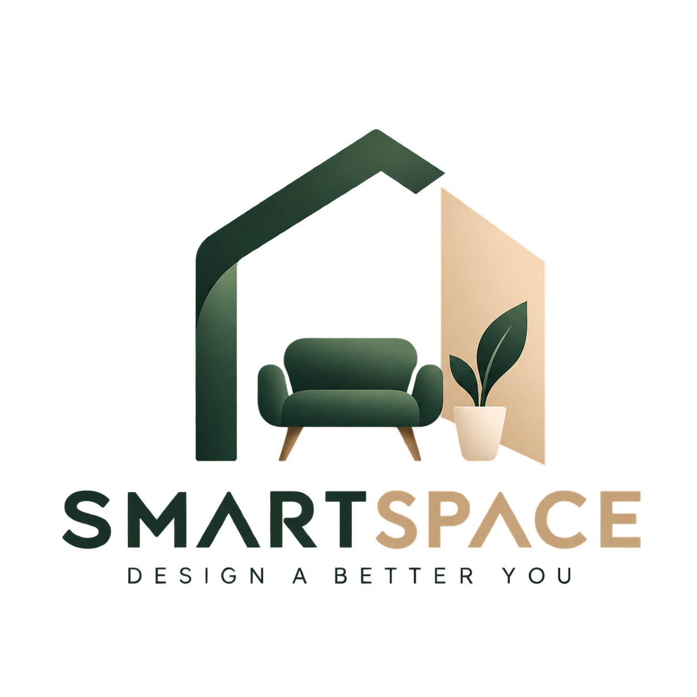
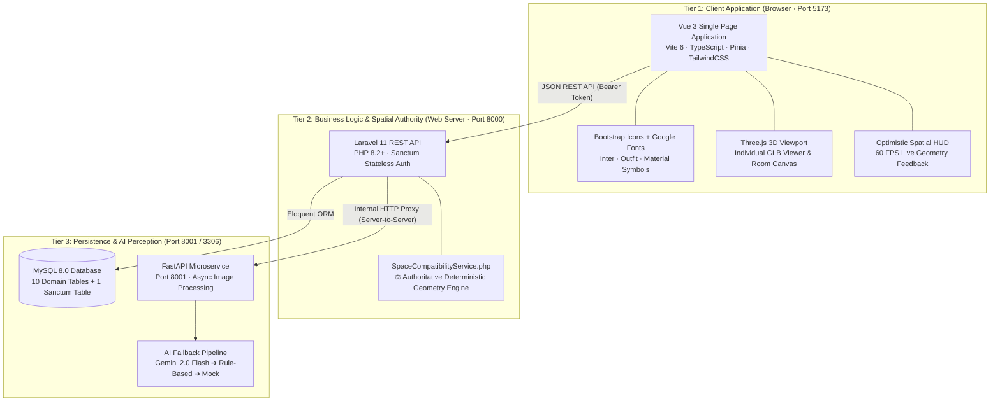

<p align="center">
  
</p>

# SmartSpace 🛋️📐
### AI-Assisted Personalized Furniture Selection & Spatial Planning System

[](https://laravel.com/)
[](https://vuejs.org/)
[](https://vitejs.dev/)
[](https://www.typescriptlang.org/)
[](https://tailwindcss.com/)
[](https://threejs.org/)
[](https://fastapi.tiangolo.com/)
[](https://www.mysql.com/)
[](#)

> **SmartSpace** pairs generative AI perceptual intelligence (computer vision style understanding, palette extraction, and architectural recognition) with a **deterministic mathematical geometry engine** (real millimeter spatial constraints, collision detection, and walking clearance verification).
> 
> Unlike conventional e-commerce platforms that offer unconstrained recommendations, SmartSpace enforces **authoritative physical truth**: furniture models maintain a locked `1.000` scale, and every suggested arrangement is certified by a deterministic spatial compatibility formula.

> ### 🎨 Figma Visual Source of Truth
> 
> The UI/UX frontend strictly implements the [SmartSpace Figma Design Reference](https://www.figma.com/make/u19FNiUxMHnCNXsA3khsAJ/Create-new-design?t=80LDP4ZSLAhuBPh1-0).
> 
> - **Visual Source of Truth**: Recreates the Figma layout, minimalist architectural aesthetics, 12–16px card radii, typography, and palette (Deep Forest Green `#173F35`, Dark Green `#0F2F28`, Warm Beige `#D8B98A`, Cream `#F7F4EE`, Off White `#FCFCFA`, Charcoal `#252A27`, Muted Gray `#737A76`, Light Border `#E5E3DD`).
> - **Architectural Separation**: The Figma prototype uses React/ReactDOM, which is **strictly design reference only**. The production frontend remains **Vue 3 + TypeScript + Vite + Tailwind + Pinia + Laravel 11 API**.
> - **Governing Rule**: *“Figma controls how SmartSpace looks. Our architecture controls how SmartSpace works.”*
> - **Spatial Invariant**: *“Never replace the deterministic geometry engine with AI-generated spatial calculations.”*
>
> ```text
>                     SMARTSPACE
>                         │
>                         ▼
>              SPATIAL PLANNING FIRST
>                         │
>              ┌──────────┴──────────┐
>              ▼                     ▼
>        🤖 AI-ASSISTED         🖐 MANUAL
>        Room Analysis          Planning
>              │                     │
>              └──────────┬──────────┘
>                         ▼
>                   3D ROOM PLANNER
>                         │
>                         ▼
>               DETERMINISTIC ENGINE
>                         │
>         ┌───────────────┼───────────────┐
>         ▼               ▼               ▼
>    Boundary Fit     Collision       Clearance
>                         │
>                         ▼
>                 Compatibility Score
>                         │
>                         ▼
>                 Curated Furniture
>                         │
>                         ▼
>                Future Purchasing
> ```

---

## 📑 Table of Contents

- [Core Research Thesis](#-core-research-thesis)
- [System Architecture](#-system-architecture)
- [Authoritative Spatial Engine & Math](#-authoritative-spatial-engine--math)
- [System Milestones & Progress](#-system-milestones--progress)
- [Technology Stack](#-technology-stack)
- [Database Schema (11 Lean Tables)](#-database-schema-11-lean-tables)
- [Curated 40-Piece Catalog](#-curated-40-piece-catalog)
- [Local Installation & Setup](#-local-installation--setup)
- [API Reference](#-api-reference)
- [Automated Testing & Build Verification](#-automated-testing--build-verification)
- [Documentation Hub](#-documentation-hub)

---

## 🔬 Core Research Thesis

In conventional furniture shopping platforms, recommendation engines typically operate on collaborative filtering or basic text attributes. Consequently:
1. **Spatial Fit Blindness**: Recommended items frequently fail to physically fit within the buyer's room niches.
2. **Circulation Bottlenecks**: Furniture placement leaves insufficient clearance corridors for human circulation ($< 60\text{ cm}$).
3. **Visual Disconnect**: Users cannot preview true-to-scale 3D models of items inside their exact room boundary prior to purchase.

### The SmartSpace Solution

```text
Traditional Furniture System:
  "Based on your profile, here is a trending sectional sofa." ❌ (Fits neither room nor doorway)

SmartSpace Constraint-Aware System:
  "Based on your room photo, this Scandinavian 3-Seater Sofa matches your aesthetic:
   ✓ Guaranteed fit within your 420 × 350 cm room boundary
   ✓ Leaves ≥ 75 cm front walking clearance to the coffee table
   ✓ Zero bounding-box collisions with existing layout
   ✓ Preserves an optimal 28.4% floor utilization ratio"
```

---

## 🏛️ System Architecture

SmartSpace is organized into a **Three-Tier Architecture** that cleanly isolates client interaction, authoritative business logic, and resilient AI perception:



### Key Architectural Boundaries

1. **Physical Scale Locked at `1.000`**:  
   3D furniture meshes (`.glb`) are authored in Blender with real-world dimensions ($W \times D \times H$ in cm) and Draco compression. Neither the frontend nor Three.js scales models arbitrarily ($S_x = S_y = S_z \equiv 1.000$).
2. **Separation of Perception and Authority**:  
   - **AI Perception (Tier 3)**: Extracts style tags, suggested color palettes, and estimated boundaries from user photos.
   - **Deterministic Geometry (Tier 2)**: Evaluates bounding box intersections, clearances, and circulation paths using pure coordinate mathematics. The AI is never permitted to guess spatial compatibility.
3. **Stateless Bearer Authentication**:  
   API communication uses Laravel Sanctum personal access tokens, allowing the Vue 3 SPA and future mobile or external clients to interact statelessly without session CSRF complications.

---

## 📐 Authoritative Spatial Engine & Math

The backend spatial validator ([`SpaceCompatibilityService.php`](file:///c:/xampp/htdocs/SmartSpace/backend/app/Services/SpaceCompatibilityService.php)) calculates an **explainable 0–100 spatial compatibility score** according to a five-part mathematical formula:

$$\text{Compatibility Score} = \max\left(0, \min\left(100, \left(100 - P_{\text{boundary}} - P_{\text{collision}} - P_{\text{clearance}} + B_{\text{utilization}}\right) \times M_{\text{room}}\right)\right)$$

Where:
- **Boundary Penalty ($P_{\text{boundary}}$)**:
  - If any furniture bounding box extends past room boundaries: $P_{\text{boundary}} = 100$ (Instant failure).
- **Collision Penalty ($P_{\text{collision}}$)**:
  - For each pair of colliding furniture items (axis-aligned bounding box or 2D polygon intersection): $-40\text{ pts}$ per collision.
- **Clearance Corridor Penalty ($P_{\text{clearance}}$)**:
  - Checks required functional envelopes ($c_{\text{front}} \ge 75\text{ cm}$, $c_{\text{side}} \ge 60\text{ cm}$, $c_{\text{back}} \ge 10\text{ cm}$).
  - Violations penalize $-10\text{ pts}$ each with itemized diagnostic warnings.
- **Space Utilization Target ($B_{\text{utilization}}$)**:
  - Target room footprint density: $15\% \le \text{Density} \le 40\%$.
  - Optimal density adds up to $+10\text{ pts}$; overcrowded rooms ($> 50\%$) receive negative deductions.
- **Room Type Appropriateness ($M_{\text{room}}$)**:
  - Functional consistency multiplier ($0.70 \le M_{\text{room}} \le 1.00$) penalizing mismatched furniture (e.g., dining tables in small bedrooms).

---

## 🚀 System Milestones & Progress

```text
[✓] Milestone 1:  Database Architecture & 40 Curated Items (11 tables, locked scale)
[✓] Milestone 2A: Deterministic Geometry Engine (SpaceCompatibilityService, 5-step score)
[✓] Milestone 2B: REST API & Sanctum Authentication (20 endpoints, W/D/H bounds filtering)
[✓] Milestone 3:  Vue 3 + Catalog UI (Pinia, Tailwind, Bootstrap Icons, Dual Room Gateway)
[🔨] Milestone 4:  Three.js 3D Individual Furniture Viewer (OrbitControls, Draco GLB, HUD)
[ ] Milestone 5:  Interactive 3D Room Planner (Three.js room canvas, live compatibility HUD)
[ ] Milestone 6:  AI Room Perception Microservice (FastAPI + Gemini 2.0 Flash + Fallback)
[ ] Milestone 7:  Inventory Management
[ ] Milestone 8:  Cart, Orders & PayMongo Payment Integration
```

---

## 💻 Technology Stack

| Layer | Technology | Version | Purpose |
| :--- | :--- | :--- | :--- |
| **Frontend Framework** | Vue.js | `3.5+` | Composition API, `<script setup lang="ts">` |
| **Build Tool** | Vite | `6.x` | Blazing fast HMR, TypeScript compilation |
| **State Management** | Pinia | `2.2+` | Auth, Catalog, Favorites, Room Projects |
| **Styling** | TailwindCSS | `3.4+` | Custom slate/brand palette, glassmorphism, responsive UI |
| **Typography & Icons** | Bootstrap Icons | `1.11.3` | Bundled font glyphs (`bi-*`) & Google Fonts (`Inter`, `Outfit`) |
| **3D Rendering** | Three.js | `r170+` | WebGL canvas, OrbitControls, DRACOLoader, GLTFLoader |
| **Backend Framework** | Laravel | `11.x` | RESTful API, Eloquent ORM, DB Seeders |
| **Authentication** | Laravel Sanctum | `4.x` | Stateless Bearer Tokens |
| **Database** | MySQL | `8.0+` | 11 relational tables, JSON spatial fields |
| **AI Microservice** | Python / FastAPI | `0.110+` | Async computer vision room perception pipeline |
| **AI Vision Model** | Google Gemini | `2.0 Flash` | Zero-shot room style and palette extraction |
| **3D Asset Formats** | glTF / GLB | `2.0` | Draco-compressed PBR furniture assets |

---

## 🗄️ Database Schema (11 Lean Tables)

The SmartSpace schema is engineered around dimensional precision, scale preservation, and auditability:

```text
1. roles                    ➔ User authorization roles (customer, designer, admin)
2. users                    ➔ Customer & admin credentials
3. personal_access_tokens   ➔ Laravel Sanctum infrastructure table
4. categories               ➔ Hierarchical furniture taxonomy (Root + Subcategories)
5. furniture                ➔ 40 Curated pieces (W/D/H dimensions, style, clearances, price)
6. furniture_images         ➔ Multi-angle photography and blueprint asset URLs
7. furniture_models         ➔ Authoritative GLB model paths, Draco compression, locked 1.000 scale
8. room_projects            ➔ User room spaces (width_cm, length_cm, height_cm, room_type)
9. room_project_furniture   ➔ Placed room items (X/Y/Z positions, rotation degrees, scale 1.000)
10. room_analyses           ➔ AI perception records (style tags, detected colors, internal raw data)
11. favorites               ➔ Customer wishlist associations
```

### Authoritative Dimensions & Clearances Contract
Every piece of furniture explicitly specifies its physical footprint and functional corridors:
```json
{
  "dimensions": {
    "width_cm": 210,
    "depth_cm": 90,
    "height_cm": 85
  },
  "clearance_envelope": {
    "front_cm": 75,
    "side_cm": 60,
    "back_cm": 10
  }
}
```

---

## 🛋️ Curated 40-Piece Catalog

The database is pre-seeded with **40 architecturally curated furniture items** distributed across four primary residential zones:

- **🛋️ Living Room (16 items)**: Sofas, Sectionals, Coffee Tables, Accent Chairs, TV Credenzas, Bookshelves.
- **🛏️ Bedroom (10 items)**: King/Queen Platform Beds, Nightstands, Wardrobes, Dressers.
- **💼 Home Office (8 items)**: Ergonomic Desks, Executive Chairs, Storage Towers.
- **🍽️ Dining Room (6 items)**: Solid Oak Dining Tables, Dining Chairs, Sideboards.

Styles represented include **Scandinavian, Minimalist, Industrial, Modern, Contemporary, and Japandi**, with real materials (Solid Oak, Top-Grain Leather, Bouclé Fabric, Powder-Coated Steel).

---

## 🛠️ Local Installation & Setup

### Prerequisites

- **PHP**: `^8.2` or `^8.3` (with `pdo_mysql`, `mbstring`, `openssl` extensions enabled)
- **Composer**: `^2.7`
- **Node.js**: `^20.x` or `^22.x` & **npm** `^10.x`
- **MySQL**: `^8.0` (Running via XAMPP or native service on port `3306`)
- **Python**: `^3.11` (For AI Microservice, Milestone 6)

---

### Step 1: Database Setup (MySQL)

Create the database in MySQL (via phpMyAdmin, MySQL Workbench, or CLI):
```sql
CREATE DATABASE IF NOT EXISTS smartspace CHARACTER SET utf8mb4 COLLATE utf8mb4_unicode_ci;
```

---

### Step 2: Backend Setup (Laravel 11)

```bash
# Navigate to backend directory
cd backend

# Install PHP dependencies
composer install

# Configure environment file
cp .env.example .env

# Generate application encryption key
php artisan key:generate

# Run database migrations and seed 40 curated furniture items
php artisan migrate:fresh --seed

# Start the Laravel development server (runs on http://127.0.0.1:8000)
php artisan serve --port=8000
```

> **Default Customer Credentials for Testing:**  
> - **Email**: `customer@smartspace.local`  
> - **Password**: `password123`

---

### Step 3: Frontend Setup (Vue 3 + Vite)

```bash
# Navigate to frontend directory in a new terminal
cd frontend

# Install Node dependencies (including bootstrap-icons, three, pinia)
npm install

# Start the Vite development server (runs on http://127.0.0.1:5173)
npm run dev -- --port 5173 --host 127.0.0.1
```

Open [http://127.0.0.1:5173](http://127.0.0.1:5173) in your browser.

---

### Step 4: AI Perception Microservice Setup (Optional - Milestone 6)

```bash
# Navigate to ai-service directory in a new terminal
cd ai-service

# Create and activate a Python virtual environment
python -m venv venv
venv\Scripts\activate      # On Windows
# source venv/bin/activate # On Linux/macOS

# Install Python requirements
pip install -r requirements.txt

# Start FastAPI server on port 8001
uvicorn app.main:app --port 8001 --reload
```

---

## 📡 API Reference

All backend API routes are versioned under `/api/v1/`:

### Public Endpoints
| Method | Endpoint | Description |
| :--- | :--- | :--- |
| `GET` | `/api/v1/categories` | List all furniture categories and subcategories |
| `GET` | `/api/v1/categories/{slug}` | Get category details with furniture count |
| `GET` | `/api/v1/furniture` | Paginated catalog with multi-dimensional W/D/H bounds filtering |
| `GET` | `/api/v1/furniture/{id}` | Authoritative furniture specifications, clearances, & 3D model metadata |

### Authentication Endpoints (Sanctum)
| Method | Endpoint | Description |
| :--- | :--- | :--- |
| `POST` | `/api/v1/auth/register` | Register new user account |
| `POST` | `/api/v1/auth/login` | Login and obtain stateless Bearer token |
| `POST` | `/api/v1/auth/logout` | Revoke current Bearer token |
| `GET` | `/api/v1/auth/me` | Fetch authenticated user profile and roles |

### Customer Protected Endpoints (`auth:sanctum`)
| Method | Endpoint | Description |
| :--- | :--- | :--- |
| `GET` | `/api/v1/favorites` | List user's favorited furniture pieces |
| `POST` | `/api/v1/favorites` | Add item to favorites |
| `DELETE` | `/api/v1/favorites/{furnitureId}`| Remove item from favorites |
| `GET` | `/api/v1/room-projects` | List customer's room projects |
| `POST` | `/api/v1/room-projects` | Create a new room project (Manual dimensions or AI vision) |
| `GET` | `/api/v1/room-projects/{id}` | Retrieve room project layout with furniture coordinate positions |
| `PUT` | `/api/v1/room-projects/{id}` | Update room project metadata |
| `DELETE` | `/api/v1/room-projects/{id}` | Delete room project |
| `PUT` | `/api/v1/room-projects/{id}/layout` | **Atomic transactional placement update** for all room furniture |
| `POST` | `/api/v1/room-projects/{id}/validate` | **Authoritative spatial check**: runs `SpaceCompatibilityService` on layout |

---

## 🧪 Automated Testing & Build Verification

### Backend Automated Test Suite
SmartSpace includes a comprehensive PHPUnit / Pest test suite covering geometry math, transactional layout updates, dimensional filtering, and boundary constraints:

```bash
cd backend
php artisan test
```
```text
   PASS  Tests\Unit\SpaceCompatibilityTest
  ✓ it calculates perfect score for well-spaced furniture
  ✓ it penalizes boundary violations heavily
  ✓ it detects bounding box collision between items
  ✓ it detects front and side clearance envelope violations
  ✓ it calculates room space utilization ratio correctly

   PASS  Tests\Feature\FurnitureApiTest
  ✓ it lists furniture with pagination
  ✓ it filters furniture by max_width_cm, max_depth_cm, and max_height_cm
  ✓ it returns authoritative physical dimensions and 3d model metadata

   PASS  Tests\Feature\RoomProjectApiTest
  ✓ it creates room project with authoritative dimensions
  ✓ it updates full room layout transactionally
  ✓ it validates room compatibility via authoritative endpoint

Tests:    22 passed (367 assertions)
Duration: 1.18s
```

### Frontend TypeScript & Production Build
The Vue 3 SPA is strictly typed:

```bash
cd frontend
npm run build
```
```text
> vue-tsc -b && vite build
✓ 140 modules transformed.
dist/index.html                                                  1.47 kB
dist/assets/bootstrap-icons-mSm7cUeB.woff2                     134.04 kB
dist/assets/index-Chx2FIl3.css                                 120.97 kB
dist/assets/index-k_vy-K0J.js                                  167.07 kB
✓ built in 3.72s (0 errors)
```

---

## 📚 Documentation Hub

For in-depth architectural notes, mathematical derivations, and capstone presentation materials, browse the [`docs/`](file:///c:/xampp/htdocs/SmartSpace/docs) directory:

- [00 - Documentation Hub](file:///c:/xampp/htdocs/SmartSpace/docs/00%20-%20Home.md): Obsidian-linked documentation root.
- [01 - Architecture Overview](file:///c:/xampp/htdocs/SmartSpace/docs/01%20-%20Architecture/01%20-%20Architecture%20Overview.md): Comprehensive 3-tier design & core spatial constraint thesis.
- [04 - Data Architecture & ERD](file:///c:/xampp/htdocs/SmartSpace/docs/04%20-%20Data): 11-table database model and relationship mapping.
- [05 - Infrastructure & Setup](file:///c:/xampp/htdocs/SmartSpace/docs/05%20-%20Infrastructure/05%20-%20Infrastructure%20&%20Setup.md): Port allocations and environment configurations.
- [09 - Improvement Roadmap](file:///c:/xampp/htdocs/SmartSpace/docs/09%20-%20Improvement%20Roadmap): Phased milestone breakdown from MVP to payment checkout.
- [99 - Space Compatibility Math](file:///c:/xampp/htdocs/SmartSpace/docs/99%20-%20Reference): Exact mathematical equations for collision, clearances, and circulation.

---

## 👥 Authors & Academic Context

- **System Title**: *SmartSpace — AI-Assisted Personalized Furniture Selection and Spatial Planning System*
- **Institution**: Capstone Research Project (2026)
- **Core Focus**: Spatial Computer Vision, Deterministic Geometry Engines, Interactive WebGL / Three.js 3D Room Planning.
