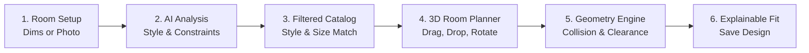

# 🏠 SmartSpace Documentation Hub

> **Core Research Thesis & Capstone Problem:**  
> *"AI-Assisted Personalized Furniture Selection and Spatial Planning System"*  
> Integrating deterministic spatial geometry algorithms (collision, clearance, fit scoring) with generative AI room perception and style matching.

---

## 📑 Knowledge Base Index

Navigate through the system documentation using the numbered categories below:

```
docs/
├── 00 - Home.md                                ← You are here (Master Hub)
├── 📁 01 - Architecture/                       ← System architecture, high-level blueprints & technical flow
├── 📁 02 - Services/                           ← Frontend, Laravel API, and FastAPI AI microservice responsibilities
├── 📁 03 - Messaging/                          ← HTTP REST protocols, Sanctum session auth, internal service proxying
├── 📁 04 - Data/                               ← 10-table lean MVP database schema & ERD
├── 📁 05 - Infrastructure/                     ← Local dev environment, port assignments & setup instructions
├── 📁 06 - Reliability/                        ← Multi-provider AI fallbacks (Gemini, Rule-Based, Mock) & error handling
├── 📁 07 - API/                                ← REST API endpoints & FastAPI JSON request/response contracts
├── 📁 08 - Operations/                         ← Blender 3D asset modeling workflow & seeding operations
├── 📁 09 - Improvement Roadmap/                ← Phased development timeline, milestones & updates
└── 📁 99 - Reference/                         ← Deterministic geometry math, original specification & archive
```

---

## 🧭 Direct Navigation

| Section | Description | Primary Document |
|:---|:---|:---|
| **01 - Architecture** | High-level 3-tier architecture & core spatial constraint thesis | [[01 - Architecture/01 - Architecture Overview\|01 - Architecture Overview]] |
| **02 - Services** | Breakdown of Vue 3 SPA, Laravel 11 Backend & FastAPI AI service | [[02 - Services/02 - Services Overview\|02 - Services Overview]] |
| **03 - Messaging** | Communication protocols, cookie auth flow & Laravel-to-FastAPI proxy | [[03 - Messaging/03 - Messaging & Protocols\|03 - Messaging & Protocols]] |
| **04 - Data** | 10 lean MVP tables, ERD diagram & placement coordinate schemas | [[04 - Data/04 - Data Architecture & ERD\|04 - Data Architecture & ERD]] |
| **05 - Infrastructure** | Development prerequisites (PHP 8.3, Node 20+, Python 3.11+, MySQL 8) & ports | [[05 - Infrastructure/05 - Infrastructure & Setup\|05 - Infrastructure & Setup]] |
| **06 - Reliability** | Zero-downtime AI fallback (Gemini $\rightarrow$ Rule-Based $\rightarrow$ Mock) & degradation | [[06 - Reliability/06 - Reliability & AI Fallbacks\|06 - Reliability & AI Fallbacks]] |
| **07 - API** | Public, customer, and AI microservice endpoints & validation contracts | [[07 - API/07 - API Specification & Contracts\|07 - API Specification & Contracts]] |
| **08 - Operations** | Blender asset modeling (PBR, Draco GLB, $<30\text{k}$ polys) & seeding | [[08 - Operations/08 - 3D Asset Pipeline & Operations\|08 - 3D Asset Pipeline & Operations]] |
| **09 - Improvement Roadmap** | 8-phase timeline, active milestones & deferred e-commerce backlog | [[09 - Improvement Roadmap/09 - Improvement Roadmap\|09 - Improvement Roadmap]] |
| **99 - Reference** | Space compatibility formula math & original specification archive | [[99 - Reference/99 - Space Compatibility Math\|99 - Space Compatibility Math]] |

---

## 🎯 The Core User Loop



> [!TIP] Obsidian Graph View
> Every note in this documentation links bi-directionally back to this `00 - Home` hub and between adjacent systems. Use Obsidian's **Graph View** (`Ctrl+G`) to visualize the architectural relationships.
