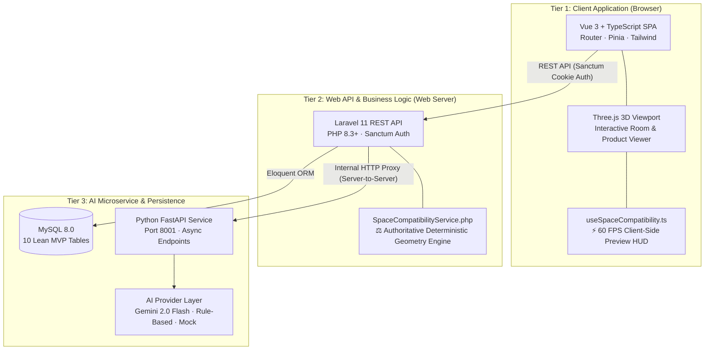

# 🏛️ 01 — Architecture Overview

Back to [[00 - Home|🏠 Documentation Hub]]

---

## 1. System Vision & Central Innovation

SmartSpace is not simply an e-commerce catalog; it is an **AI-assisted spatial planning platform**. The central research contribution is:

> **Generative AI recommendations are strictly constrained by real physical geometry.**

```text
Traditional Recommender System:
  "Based on your profile, here is a popular sofa."

SmartSpace Constraint-Aware System:
  "Based on your room photo, this sofa matches your Scandinavian aesthetic
   AND it fits within your 350×420 cm room
   AND leaves ≥ 75 cm front walking clearance
   AND causes zero collision with your existing coffee table."
```

---

## 2. Three-Tier System Architecture



---

## 3. Key Architectural Principles

1. **Client-Side Preview vs. Backend Authority**:
   - `useSpaceCompatibility.ts` provides instant optimistic feedback at 60 FPS during drag-and-drop.
   - `SpaceCompatibilityService.php` is the authoritative single source of truth that certifies designs upon save.
2. **AI vs. Deterministic Algorithmic Division**:
   - AI handles *perceptual tasks* (detecting style, room type, color palette, aesthetics).
   - Deterministic algorithms handle *spatial calculations* (bounding box overlap, clearances, dimensions, circulation ratio).
3. **Resilient Provider Fallback**:
   - If Gemini is unreachable or rate-limited, the system falls back to rule-based heuristics, and finally to a mock provider, guaranteeing zero downtime during capstone defense demonstrations.
