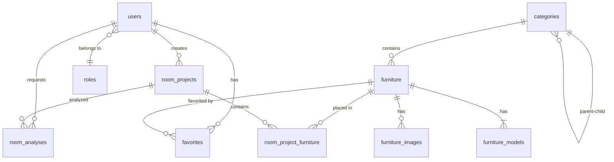

# 🗄️ 04 — Data Architecture & ERD

Back to [[00 - Home|🏠 Documentation Hub]]

---

## 1. The 10-Table Lean MVP Schema

To ensure rapid development and eliminate feature bloat, the database is strictly bounded to **10 tables**:



---

## 2. Table Definitions & Fields

### Core User & Access
* **`roles`**: `id`, `name`, `slug` (`admin`, `customer`), `created_at`.
* **`users`**: `id`, `name`, `email`, `password`, `role_id` (FK), `avatar`, `created_at`, `updated_at`.

### Catalog & 3D Assets
* **`categories`**: `id`, `name`, `slug`, `parent_id` (self-FK nullable), `image`, `is_active`.
* **`furniture`**: `id`, `sku`, `name`, `category_id` (FK), `price`, `width_cm`, `height_cm`, `depth_cm`, `style`, `material`, `color`, `glb_model_path`, `is_active`.
* **`furniture_images`**: `id`, `furniture_id` (FK), `image_path`, `is_primary`, `sort_order`.
* **`furniture_models`**: `id`, `furniture_id` (FK), `model_path`, `format` (`glb`), `file_size_mb`, `is_optimized`.

### Spatial Planning & AI Perception
* **`room_projects`**: `id`, `user_id` (FK), `name`, `room_type`, `width_cm`, `length_cm`, `height_cm`, `style`, `room_image_path`, `compatibility_score` (0-100), `score_breakdown` (JSON), `created_at`.
* **`room_project_furniture`**: `id`, `room_project_id` (FK), `furniture_id` (FK), `position_x`, `position_y`, `position_z`, `rotation_y`, `scale`.
* **`room_analyses`**: `id`, `user_id` (FK), `room_project_id` (FK nullable), `image_path`, `detected_room_type`, `detected_style`, `detected_colors` (JSON array of HEX), `confidence`, `ai_provider`.
* **`favorites`**: `id`, `user_id` (FK), `furniture_id` (FK), `created_at`.

---

## 3. 3D Coordinate Convention

All 3D coordinate placements in `room_project_furniture` use the standard Three.js right-handed coordinate system:
* **`position_x`**: Horizontal translation across room width (in meters).
* **`position_y`**: Elevation off the floor (default $0.00\text{ m}$ for floor-standing furniture).
* **`position_z`**: Depth translation across room length (in meters).
* **`rotation_y`**: Rotation angle around the vertical Y-axis (in radians or degrees).

---

## 4. Database Backup & Snapshot (`smartspace.sql`)

A complete, production-ready snapshot of the live MariaDB / MySQL database is version-controlled at repository root: [`smartspace.sql`](file:///c:/xampp/htdocs/SmartSpace/smartspace.sql).

### Table Record Summary:
| Table Name | Row Count | Primary Contents |
|:---|:---:|:---|
| `categories` | 13 | 4 root + 9 child furniture categories |
| `furniture` | 40 | Catalog with real metric dimensions, materials, styles & pricing |
| `furniture_images` | 42 | Product showroom photographs & multi-angle gallery renders |
| `furniture_models` | 40 | WebGL GLB paths and Draco compression metadata |
| `users` | 7 | Test customers (`alex@example.com`) and administrators |
| `room_projects` | 3 | Dimensioned user rooms (e.g. Nordik Living Room $4.5\text{m} \times 5.0\text{m}$) |
| `room_project_furniture` | 11 | Placed pieces with certified coordinates, rotation, and locked scale 1.000 |
| `favorites` | 3 | Customer wishlists |
| `personal_access_tokens` | 20 | Active Laravel Sanctum API tokens |
| `roles` | 2 | `admin` and `customer` |

To restore or import via phpMyAdmin:
```bash
mysql -u root smartspace < smartspace.sql
```
Or import via phpMyAdmin at [http://localhost/phpmyadmin](http://localhost/phpmyadmin).
