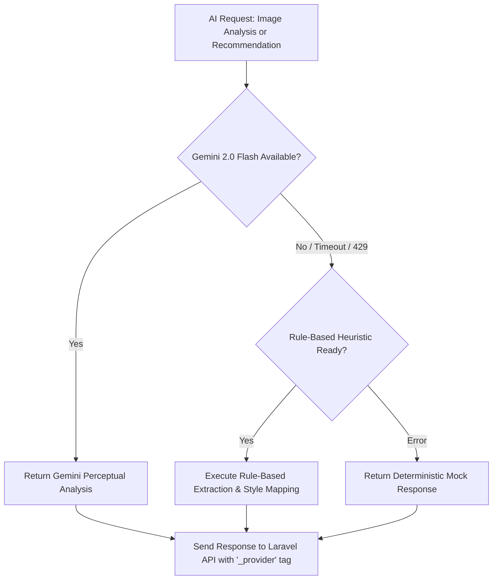

# 🛡️ 06 — Reliability & AI Fallbacks

Back to [[00 - Home|🏠 Documentation Hub]]

---

## 1. Zero-Downtime Multi-Provider Strategy

One of the greatest hazards in an academic defense demo is external API rate-limiting, network dropouts, or AI quota exhaustion. SmartSpace uses a **3-tier provider hierarchy**:

### Tier 1: Gemini 2.0 Flash (`gemini_provider.py`)
* Primary production provider.
* Performs multimodal vision analysis to detect visual style, color palette, room type, and clutter.

### Tier 2: Rule-Based Fallback (`rule_based.py`)
* Activated if Gemini returns a 429, 5xx, or times out after 15 seconds.
* Maps user room type hints and dimensions to pre-calibrated aesthetic pairings without calling external APIs.

### Tier 3: Mock Provider (`mock_provider.py`)
* Guaranteed zero-dependency fallback for local testing and offline defense mode.
* Injects `"_mock": true` and displays an informative UI badge so evaluators clearly understand system state.

---

## 2. Graceful System Degradation

The system is architected so that **AI is an enhancement, not a single point of failure**:
* If the AI microservice is completely stopped:
  * Catalog browsing remains **100% operational**.
  * 3D product inspection remains **100% operational**.
  * Room creation with manual dimensions remains **100% operational**.
  * 3D room planner & drag-and-drop remain **100% operational**.
  * The deterministic space compatibility engine remains **100% operational**.
