# 🏠 SmartSpace — AI-Powered Furniture Catalog & Smart Room Visualization

> [!abstract] Project Summary
> A web-based intelligent furniture catalog and room visualization platform that lets customers **browse furniture**, **visualize it in 3D rooms**, **check if it fits**, **get AI-powered style recommendations**, **plan budgets**, and **order/reserve** — all in one system.

> [!IMPORTANT]
> ### FIGMA VISUAL SOURCE OF TRUTH
>
> Use the provided SmartSpace Figma design ([Figma Design Reference](https://www.figma.com/make/u19FNiUxMHnCNXsA3khsAJ/Create-new-design?t=80LDP4ZSLAhuBPh1-0)) as the **primary visual and UX reference** for the frontend.
>
> Recreate the Figma design's:
> * Overall visual hierarchy
> * Page layouts
> * Navigation structure
> * Typography
> * Spacing and proportions
> * Card styles
> * Border radius (12–16px rounded cards)
> * Button styles
> * Color usage (Deep Forest Green `#173F35`, Dark Green `#0F2F28`, Warm Beige `#D8B98A`, Cream `#F7F4EE`, Off White `#FCFCFA`, Charcoal `#252A27`, Muted Gray `#737A76`, Light Border `#E5E3DD`)
> * Hero composition ("Design a Space That Fits You." + "AI recommends · You decide · Geometry verifies.")
> * Furniture card presentation
> * Product-detail composition
> * My Spaces layout
> * Modal design
> * Responsive behavior
> * Architectural/minimalist aesthetic
> * Logo and SmartSpace branding
>
> **Do NOT copy the Figma-generated React source code.**
>
> The Figma prototype is a **design reference only**. The production application must remain:
> ```text
> Vue 3
> TypeScript
> Vite
> Tailwind CSS
> Pinia
> Vue Router
> Axios
> Laravel 11 REST API
> ```
>
> The Figma prototype currently uses React/ReactDOM, so its implementation architecture must be ignored. Preserve the Figma visual identity while replacing all mock/static data with the real Laravel API.
>
> **Core Architectural Principle:**
> > **Figma controls how SmartSpace looks. Our architecture controls how SmartSpace works.**
>
> - **Figma** → visual design, UX, layout, branding
> - **Vue** → components, pages, state, routing
> - **Pinia** → application/project/catalog state
> - **Laravel** → real data and business logic
> - **Three.js** → actual 3D visualization
> - **SpaceCompatibilityService** → authoritative spatial verification
> - **AI** → perception and recommendations only
>
> **CRITICAL SPATIAL INVARIANT:**
> > **Never replace the deterministic geometry engine with AI-generated spatial calculations.**
> > The furniture must remain at its actual physical dimensions and locked `1.000` scale, while the backend remains the authority for compatibility.
>
> ```text
>                     SMARTSPACE
>                         │
>                         ▼
>              SPATIAL PLANNING FIRST
>                         │
>              ┌──────────┴──────────┐
>              ▼                     ▼
>        🤖 AI-ASSISTED         🖐 MANUAL
>        Room Analysis          Planning
>              │                     │
>              └──────────┬──────────┘
>                         ▼
>                   3D ROOM PLANNER
>                         │
>                         ▼
>               DETERMINISTIC ENGINE
>                         │
>         ┌───────────────┼───────────────┐
>         ▼               ▼               ▼
>    Boundary Fit     Collision       Clearance
>                         │
>                         ▼
>                 Compatibility Score
>                         │
>                         ▼
>                 Curated Furniture
>                         │
>                         ▼
>                Future Purchasing
> ```

---

## 📑 Table of Contents

1. [[#1 — Executive Summary]]
2. [[#2 — System Architecture]]
3. [[#3 — Technology Stack]]
4. [[#4 — Database Design (ERD)]]
5. [[#5 — API Specification]]
6. [[#6 — AI Service Architecture]]
7. [[#7 — 3D Engine Architecture]]
8. [[#8 — Frontend Architecture]]
9. [[#9 — Backend Architecture]]
10. [[#10 — Security Plan]]
11. [[#11 — Folder Structure]]
12. [[#12 — Feature Breakdown]]
13. [[#13 — Development Roadmap (8 Phases)]]
14. [[#14 — Environment & Configuration]]
15. [[#15 — Deployment & DevOps]]
16. [[#16 — Testing Strategy]]
17. [[#17 — Blender Asset Pipeline]]
18. [[#18 — Setup Instructions]]

---

## 1 — Executive Summary

### The Problem

| Problem | Impact |
|:---|:---|
| 🔲 **Will it fit?** | Furniture returned due to size mismatch |
| 🎨 **Will it look good?** | Style clashes with existing room décor |
| 🪑 **Will pieces work together?** | Mismatched furniture combinations |
| 💰 **Will it fit my budget?** | Overspending or underutilizing budget |
| 👁️ **Can I visualize it?** | No way to "try before you buy" |

### The Solution

> [!success] SmartSpace answers all five problems in one platform:
> - **3D Room Planner** with real-world dimensions
> - **Space Compatibility Engine** (deterministic — no fake AI)
> - **AI Room Analysis** from uploaded photos
> - **AI Style Matching & Recommendations**
> - **Room Package Recommendations** (full room sets)
> - **AI Layout Suggestions** (optimal furniture arrangements)
> - **Lighting Preview** (daylight, evening, warm, showroom)
> - **Budget Planner** with real-time tracking

### Design Philosophy: AI vs Algorithm

> [!important] Core Principle
> Use **AI** where it provides *meaningful value*. Use **deterministic algorithms** where *reliability* matters more.

| ✅ Use AI When | ⚙️ Use Algorithms When |
|:---|:---|
| Style matching & recommendations | Dimension calculations |
| Room image analysis | Collision/overlap detection |
| Color harmony assessment | Space compatibility scores |
| Natural language preferences | Budget math |
| Layout aesthetic optimization | Inventory/stock checks |
| Room package curation | Pricing & discounts |
| Personalized suggestions | Room boundary enforcement |
| Image understanding | Walking space calculations |

**Example:**
- 🤖 **AI:** *"This sofa matches the user's minimalist room style."*
- ⚙️ **Algorithm:** *"The sofa is 220 cm wide but the available space is only 180 cm. Therefore it does not fit."*

> [!warning] Graceful Degradation
> The system **MUST** remain fully functional if the AI service goes down. Catalog, 3D viewer, room planner, space compatibility, and budget planning work independently. Only AI-specific features (recommendations, room analysis, style matching) become unavailable.

---

## 2 — System Architecture

### High-Level Overview

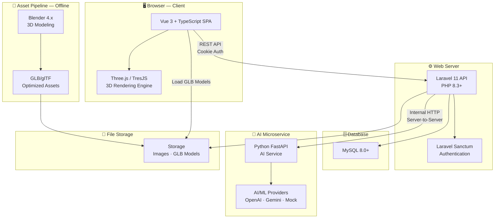

### Service Communication Flow

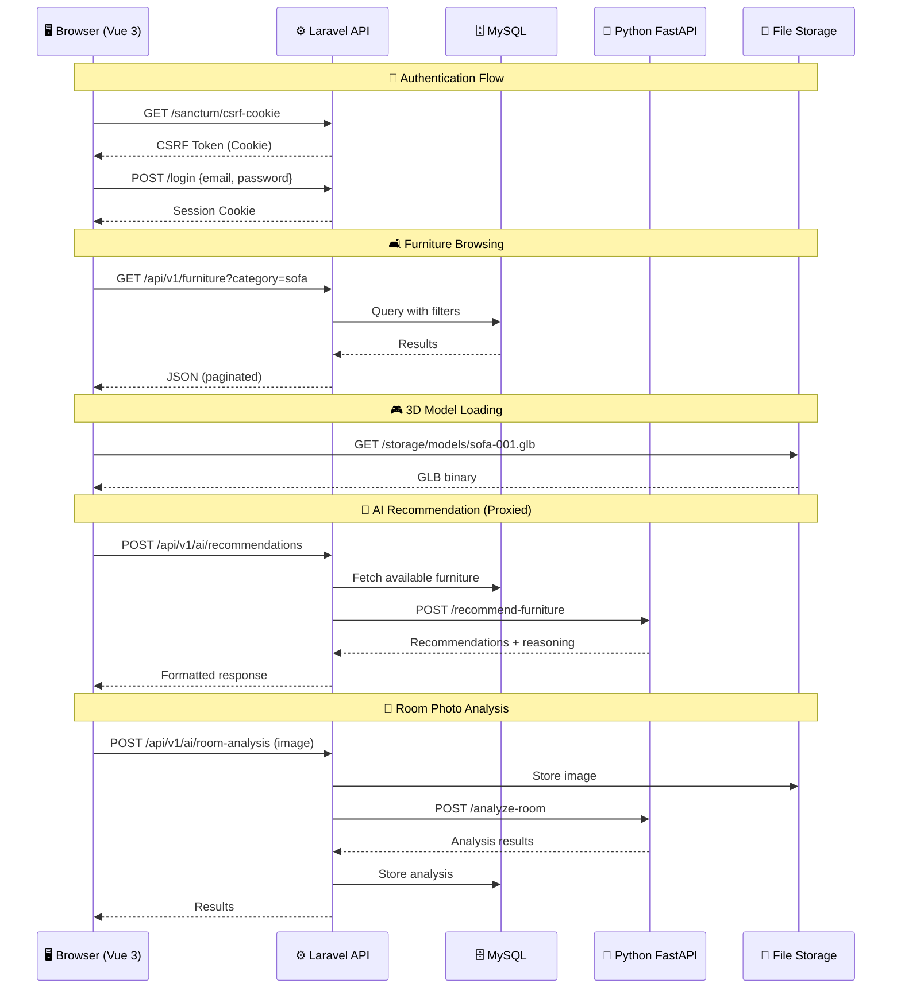

### Architecture Principles

| Principle | How It's Applied |
|:---|:---|
| **Separation of Concerns** | Frontend / Backend / AI / Assets are independent |
| **Graceful Degradation** | AI down → core features still work |
| **API-First** | All data through versioned REST API |
| **Single Source of Truth** | Database/API — never hardcoded frontend data |
| **Proxy Pattern** | Browser → Laravel → AI (browser never hits AI directly) |
| **Real Dimensions** | Room planner uses actual cm-based measurements |
| **On-Demand Loading** | GLB models loaded when needed, cached after |

### 🔄 User Flows

#### Customer Journey

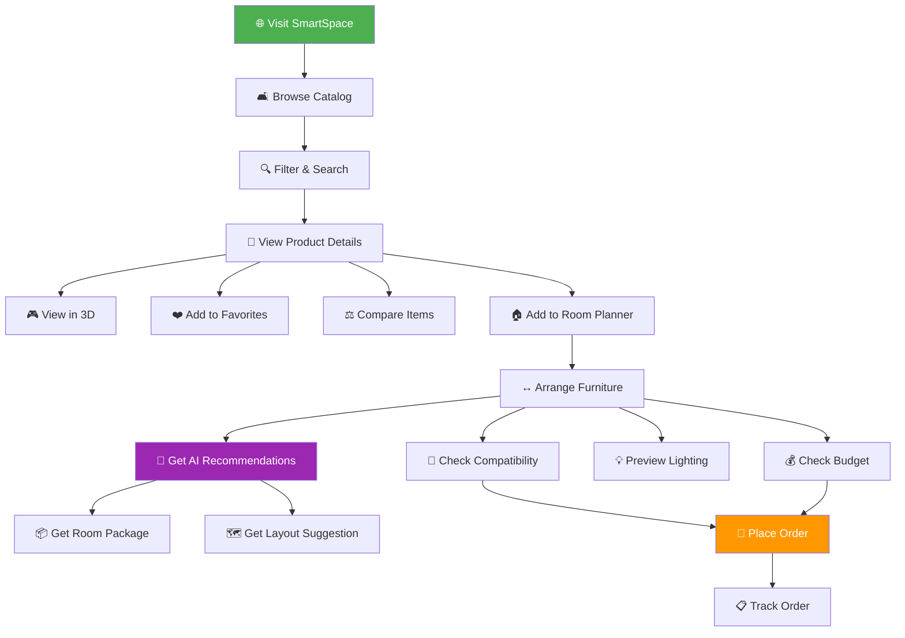

#### Authentication Flow

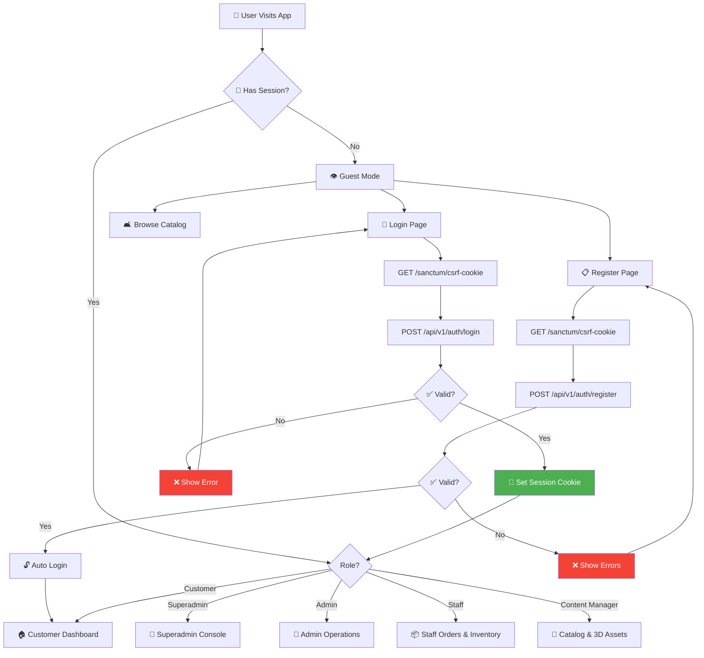

#### Room Planner Workflow

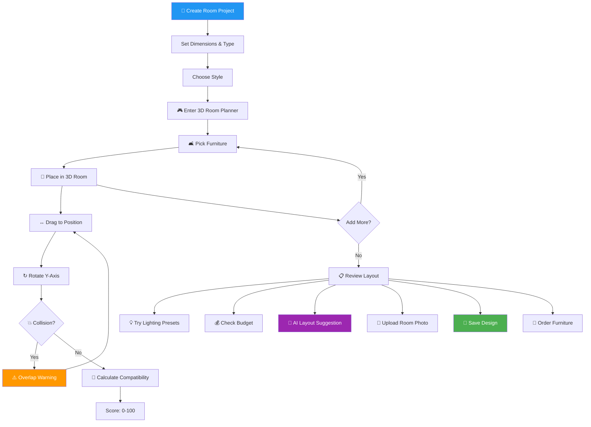

#### AI Room Analysis Flow

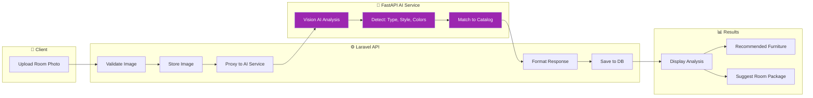

#### Order Lifecycle

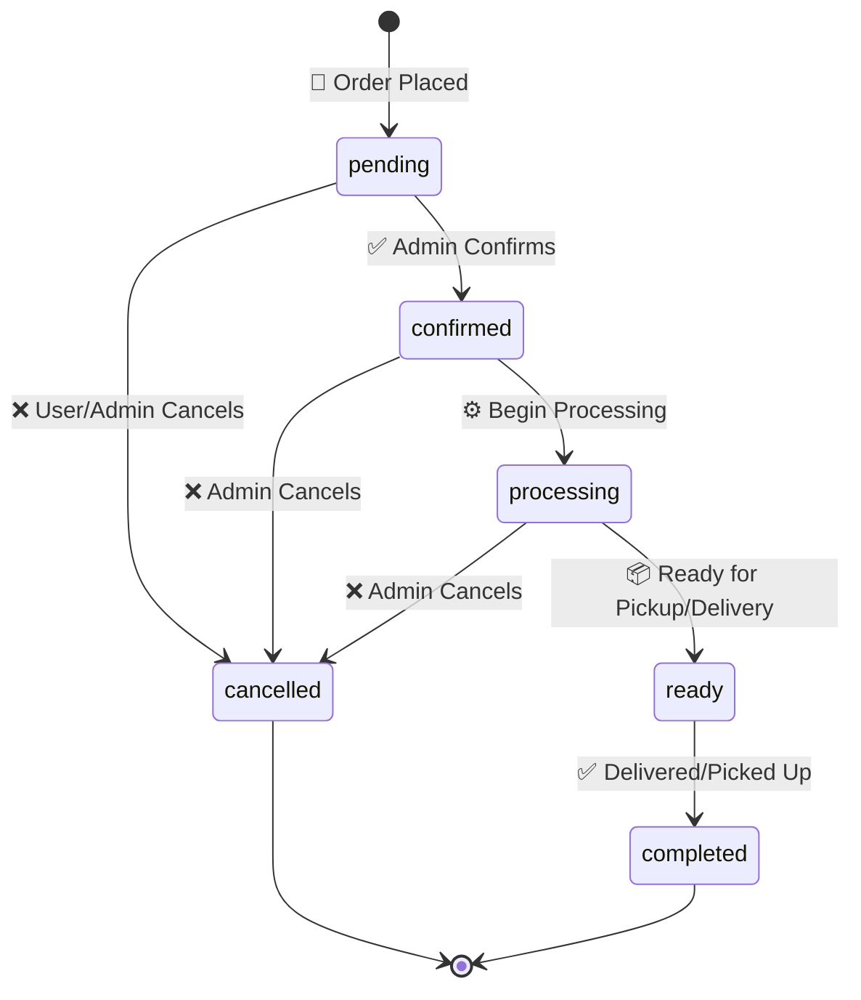

#### Admin Furniture Management Flow

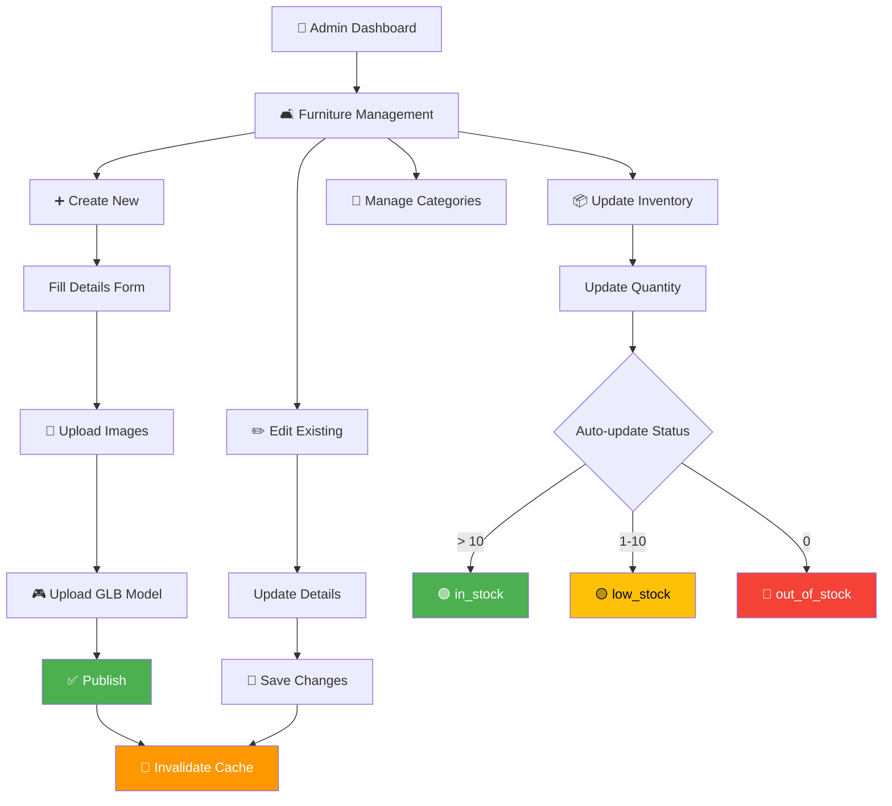

---

## 3 — Technology Stack

### Frontend #frontend

| Technology | Version | Purpose |
|:---|:---|:---|
| **Vue 3** | 3.5+ | UI framework (Composition API + `<script setup>`) |
| **TypeScript** | 5.x | Full type safety |
| **Vite** | 6.x | Build tool & dev server |
| **Tailwind CSS** | 4.x | Utility-first styling |
| **Pinia** | 2.x | State management |
| **Vue Router** | 4.x | Client-side routing with guards |
| **TresJS** | 4.x | Declarative Three.js for Vue 3 |
| **@tresjs/cientos** | 4.x | GLTFModel, OrbitControls, helpers |
| **Three.js** | 0.170+ | 3D engine (peer dep via TresJS) |
| **Axios** | 1.x | HTTP client with interceptors |
| **VueUse** | 11.x | Composition utilities |
| **Chart.js** | 4.x | Admin analytics charts |

### Backend #backend

| Technology | Version | Purpose |
|:---|:---|:---|
| **PHP** | 8.3+ | Server language |
| **Laravel** | 11.x | API framework |
| **Laravel Sanctum** | 4.x | Cookie-based SPA auth |
| **MySQL** | 8.0+ | Database |
| **Intervention Image** | 3.x | Image processing |
| **GuzzleHTTP** | 7.x | HTTP client → AI service |
| **PHPUnit** | 11.x | Testing |

### AI Service #ai-service

| Technology        | Version | Purpose                        |
| :---------------- | :------ | :----------------------------- |
| **Python**        | 3.11+   | AI service language            |
| **FastAPI**       | 0.115+  | Async API framework            |
| **Uvicorn**       | 0.30+   | ASGI server                    |
| **Pydantic**      | 2.x     | Validation                     |
| **Pillow**        | 10.x    | Image processing               |
| **scikit-learn**  | 1.5+    | ML algorithms                  |
| **NumPy**         | 2.x     | Numerical computation          |
| **OpenAI SDK**    | latest  | LLM integration (pluggable)    |
| **Google AI SDK** | latest  | Gemini integration (pluggable) |

### 3D Asset Pipeline #3d-pipeline

| Tool | Purpose |
|:---|:---|
| **Blender 4.x** | 3D modeling, UV mapping, materials |
| **glTF-Transform CLI** | GLB optimization, Draco compression |
| **Three.js GLTFLoader** | Runtime model loading |
| **Draco Decoder** | Mesh decompression (self-hosted) |

---

## 4 — Database Design (ERD)

### Entity Relationship Diagram

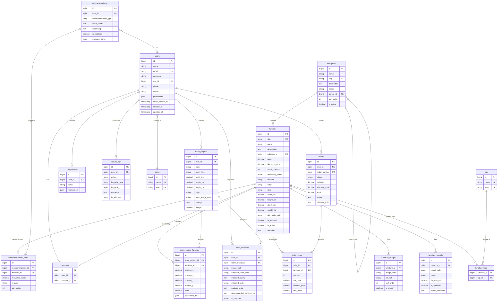

### Table Count: **17 tables**

### Key Table Definitions

#### `users`

```sql
CREATE TABLE users (
    id                BIGINT UNSIGNED AUTO_INCREMENT PRIMARY KEY,
    name              VARCHAR(255) NOT NULL,
    email             VARCHAR(255) NOT NULL UNIQUE,
    password          VARCHAR(255) NOT NULL,
    role_id           BIGINT UNSIGNED NOT NULL DEFAULT 5, -- 1=superadmin, 2=admin, 3=staff, 4=content_manager, 5=customer
    phone             VARCHAR(20) NULL,
    avatar            VARCHAR(500) NULL,
    preferences       JSON NULL, -- {preferred_style, preferred_colors, budget_range}
    email_verified_at TIMESTAMP NULL,
    remember_token    VARCHAR(100) NULL,
    created_at        TIMESTAMP NULL,
    updated_at        TIMESTAMP NULL,
    INDEX idx_users_role (role_id),
    FOREIGN KEY (role_id) REFERENCES roles(id)
);
```

#### `furniture`

```sql
CREATE TABLE furniture (
    id                  BIGINT UNSIGNED AUTO_INCREMENT PRIMARY KEY,
    sku                 VARCHAR(50) NOT NULL UNIQUE,
    name                VARCHAR(255) NOT NULL,
    description         TEXT NULL,
    category_id         BIGINT UNSIGNED NOT NULL,
    price               DECIMAL(12,2) NOT NULL,
    discount_price      DECIMAL(12,2) NULL,
    stock_quantity      INT UNSIGNED NOT NULL DEFAULT 0,
    availability_status ENUM('in_stock','low_stock','out_of_stock','pre_order','discontinued')
                        NOT NULL DEFAULT 'in_stock',
    material            VARCHAR(100) NULL,
    color               VARCHAR(100) NULL,
    style               VARCHAR(100) NULL,
    width_cm            DECIMAL(8,2) NOT NULL,
    height_cm           DECIMAL(8,2) NOT NULL,
    depth_cm            DECIMAL(8,2) NOT NULL,
    weight_kg           DECIMAL(8,2) NULL,
    glb_model_path      VARCHAR(500) NULL,
    is_featured         BOOLEAN NOT NULL DEFAULT FALSE,
    is_active           BOOLEAN NOT NULL DEFAULT TRUE,
    metadata            JSON NULL,
    created_at          TIMESTAMP NULL,
    updated_at          TIMESTAMP NULL,
    
    INDEX idx_furniture_category (category_id),
    INDEX idx_furniture_style (style),
    INDEX idx_furniture_price (price),
    INDEX idx_furniture_availability (availability_status),
    INDEX idx_furniture_active (is_active),
    FULLTEXT idx_furniture_search (name, description),
    FOREIGN KEY (category_id) REFERENCES categories(id)
);
```

#### `room_projects`

```sql
CREATE TABLE room_projects (
    id              BIGINT UNSIGNED AUTO_INCREMENT PRIMARY KEY,
    user_id         BIGINT UNSIGNED NOT NULL,
    name            VARCHAR(255) NOT NULL,
    room_type       VARCHAR(50) NULL,
    width_cm        DECIMAL(8,2) NOT NULL,
    length_cm       DECIMAL(8,2) NOT NULL,
    height_cm       DECIMAL(8,2) NULL DEFAULT 270,
    style           VARCHAR(100) NULL,
    room_image_path VARCHAR(500) NULL,
    settings        JSON NULL, -- {wall_color, floor_type, lighting_preset}
    budget          DECIMAL(12,2) NULL,
    created_at      TIMESTAMP NULL,
    updated_at      TIMESTAMP NULL,
    INDEX idx_room_projects_user (user_id),
    FOREIGN KEY (user_id) REFERENCES users(id) ON DELETE CASCADE
);
```

#### `orders`

```sql
CREATE TABLE orders (
    id              BIGINT UNSIGNED AUTO_INCREMENT PRIMARY KEY,
    user_id         BIGINT UNSIGNED NOT NULL,
    order_number    VARCHAR(20) NOT NULL UNIQUE,
    status          ENUM('pending','confirmed','processing','ready','completed','cancelled')
                    NOT NULL DEFAULT 'pending',
    subtotal        DECIMAL(12,2) NOT NULL,
    discount_total  DECIMAL(12,2) NOT NULL DEFAULT 0,
    total           DECIMAL(12,2) NOT NULL,
    notes           TEXT NULL,
    shipping_info   JSON NULL,
    created_at      TIMESTAMP NULL,
    updated_at      TIMESTAMP NULL,
    INDEX idx_orders_user (user_id),
    INDEX idx_orders_status (status),
    FOREIGN KEY (user_id) REFERENCES users(id)
);
```

#### `roles`

```sql
CREATE TABLE roles (
    id          BIGINT UNSIGNED AUTO_INCREMENT PRIMARY KEY,
    name        VARCHAR(50) NOT NULL UNIQUE,
    slug        VARCHAR(50) NOT NULL UNIQUE,
    description VARCHAR(255) NULL,
    created_at  TIMESTAMP NULL,
    updated_at  TIMESTAMP NULL
);
```

| ID | Name | Slug | Scope & Responsibilities |
|:---:|:---|:---|:---|
| **1** | **Superadmin** | `superadmin` | System owner: admin/staff user management, security audit logs, API key configs, backup & system settings |
| **2** | **Admin** | `admin` | Business operations: sales analytics, customer oversight, inventory health, order lifecycle management |
| **3** | **Staff** | `staff` | Order fulfillment & warehouse operations: order status updates (processing/ready/shipped), stock adjustments |
| **4** | **Content Manager** | `content_manager` | Catalog & 3D assets: furniture CRUD, specifications, materials, categories, uploading & calibrating 3D `.glb` models |
| **5** | **Customer** | `customer` | Shopper: browse catalog, 3D room planner, space compatibility check, AI room analysis, favorites, place orders |

#### `categories`

```sql
CREATE TABLE categories (
    id          BIGINT UNSIGNED AUTO_INCREMENT PRIMARY KEY,
    name        VARCHAR(255) NOT NULL,
    slug        VARCHAR(255) NOT NULL UNIQUE,
    description TEXT NULL,
    image       VARCHAR(500) NULL,
    parent_id   BIGINT UNSIGNED NULL,
    sort_order  INT NOT NULL DEFAULT 0,
    is_active   BOOLEAN NOT NULL DEFAULT TRUE,
    created_at  TIMESTAMP NULL,
    updated_at  TIMESTAMP NULL,
    INDEX idx_categories_parent (parent_id),
    INDEX idx_categories_active (is_active),
    FOREIGN KEY (parent_id) REFERENCES categories(id) ON DELETE SET NULL
);
```

#### `furniture_images`

```sql
CREATE TABLE furniture_images (
    id            BIGINT UNSIGNED AUTO_INCREMENT PRIMARY KEY,
    furniture_id  BIGINT UNSIGNED NOT NULL,
    image_path    VARCHAR(500) NOT NULL,
    alt_text      VARCHAR(255) NULL,
    sort_order    INT NOT NULL DEFAULT 0,
    is_primary    BOOLEAN NOT NULL DEFAULT FALSE,
    created_at    TIMESTAMP NULL,
    updated_at    TIMESTAMP NULL,
    INDEX idx_fimg_furniture (furniture_id),
    FOREIGN KEY (furniture_id) REFERENCES furniture(id) ON DELETE CASCADE
);
```

#### `furniture_models`

```sql
CREATE TABLE furniture_models (
    id              BIGINT UNSIGNED AUTO_INCREMENT PRIMARY KEY,
    furniture_id    BIGINT UNSIGNED NOT NULL,
    model_path      VARCHAR(500) NOT NULL,
    format          VARCHAR(10) NOT NULL DEFAULT 'glb',
    file_size_mb    DECIMAL(6,2) NULL,
    is_optimized    BOOLEAN NOT NULL DEFAULT FALSE,
    model_metadata  JSON NULL,
    created_at      TIMESTAMP NULL,
    updated_at      TIMESTAMP NULL,
    INDEX idx_fmod_furniture (furniture_id),
    FOREIGN KEY (furniture_id) REFERENCES furniture(id) ON DELETE CASCADE
);
```

#### `tags`

```sql
CREATE TABLE tags (
    id         BIGINT UNSIGNED AUTO_INCREMENT PRIMARY KEY,
    name       VARCHAR(100) NOT NULL UNIQUE,
    slug       VARCHAR(100) NOT NULL UNIQUE,
    created_at TIMESTAMP NULL,
    updated_at TIMESTAMP NULL
);
```

#### `furniture_tags` *(pivot)*

```sql
CREATE TABLE furniture_tags (
    furniture_id BIGINT UNSIGNED NOT NULL,
    tag_id       BIGINT UNSIGNED NOT NULL,
    PRIMARY KEY (furniture_id, tag_id),
    FOREIGN KEY (furniture_id) REFERENCES furniture(id) ON DELETE CASCADE,
    FOREIGN KEY (tag_id) REFERENCES tags(id) ON DELETE CASCADE
);
```

#### `favorites`

```sql
CREATE TABLE favorites (
    id            BIGINT UNSIGNED AUTO_INCREMENT PRIMARY KEY,
    user_id       BIGINT UNSIGNED NOT NULL,
    furniture_id  BIGINT UNSIGNED NOT NULL,
    created_at    TIMESTAMP NULL,
    updated_at    TIMESTAMP NULL,
    UNIQUE KEY unique_user_furniture (user_id, furniture_id),
    FOREIGN KEY (user_id) REFERENCES users(id) ON DELETE CASCADE,
    FOREIGN KEY (furniture_id) REFERENCES furniture(id) ON DELETE CASCADE
);
```

#### `room_project_furniture`

```sql
CREATE TABLE room_project_furniture (
    id                BIGINT UNSIGNED AUTO_INCREMENT PRIMARY KEY,
    room_project_id   BIGINT UNSIGNED NOT NULL,
    furniture_id      BIGINT UNSIGNED NOT NULL,
    position_x        DECIMAL(10,2) NOT NULL DEFAULT 0,
    position_y        DECIMAL(10,2) NOT NULL DEFAULT 0,
    position_z        DECIMAL(10,2) NOT NULL DEFAULT 0,
    rotation_y        DECIMAL(6,2) NOT NULL DEFAULT 0,
    scale             DECIMAL(4,2) NOT NULL DEFAULT 1.00,
    placement_data    JSON NULL, -- {custom_color, notes}
    created_at        TIMESTAMP NULL,
    updated_at        TIMESTAMP NULL,
    INDEX idx_rpf_room (room_project_id),
    INDEX idx_rpf_furniture (furniture_id),
    FOREIGN KEY (room_project_id) REFERENCES room_projects(id) ON DELETE CASCADE,
    FOREIGN KEY (furniture_id) REFERENCES furniture(id) ON DELETE CASCADE
);
```

#### `room_analyses`

```sql
CREATE TABLE room_analyses (
    id                        BIGINT UNSIGNED AUTO_INCREMENT PRIMARY KEY,
    user_id                   BIGINT UNSIGNED NOT NULL,
    room_project_id           BIGINT UNSIGNED NULL,
    image_path                VARCHAR(500) NOT NULL,
    detected_room_type        VARCHAR(50) NULL,
    detected_colors           JSON NULL, -- ["#FFFFFF", "#8B4513"]
    detected_style            VARCHAR(100) NULL,
    analysis_data             JSON NULL, -- full AI response
    recommended_furniture_ids JSON NULL, -- [12, 45, 78]
    ai_provider               VARCHAR(50) NULL, -- openai | gemini | mock
    created_at                TIMESTAMP NULL,
    updated_at                TIMESTAMP NULL,
    INDEX idx_room_analyses_user (user_id),
    INDEX idx_room_analyses_room (room_project_id),
    FOREIGN KEY (user_id) REFERENCES users(id) ON DELETE CASCADE,
    FOREIGN KEY (room_project_id) REFERENCES room_projects(id) ON DELETE SET NULL
);
```

#### `recommendations`

```sql
CREATE TABLE recommendations (
    id                   BIGINT UNSIGNED AUTO_INCREMENT PRIMARY KEY,
    user_id              BIGINT UNSIGNED NOT NULL,
    recommendation_type  VARCHAR(50) NOT NULL, -- style_match | room_package | general
    input_criteria       JSON NULL, -- request params stored
    reasoning            JSON NULL, -- AI reasoning stored
    is_package           BOOLEAN NOT NULL DEFAULT FALSE,
    package_name         VARCHAR(255) NULL,
    created_at           TIMESTAMP NULL,
    updated_at           TIMESTAMP NULL,
    INDEX idx_recommendations_user (user_id),
    FOREIGN KEY (user_id) REFERENCES users(id) ON DELETE CASCADE
);
```

#### `recommendation_items`

```sql
CREATE TABLE recommendation_items (
    id                BIGINT UNSIGNED AUTO_INCREMENT PRIMARY KEY,
    recommendation_id BIGINT UNSIGNED NOT NULL,
    furniture_id      BIGINT UNSIGNED NOT NULL,
    relevance_score   DECIMAL(5,2) NULL, -- 0.00 to 100.00
    reason            VARCHAR(500) NULL,
    sort_order        INT NOT NULL DEFAULT 0,
    created_at        TIMESTAMP NULL,
    updated_at        TIMESTAMP NULL,
    INDEX idx_rec_items_rec (recommendation_id),
    FOREIGN KEY (recommendation_id) REFERENCES recommendations(id) ON DELETE CASCADE,
    FOREIGN KEY (furniture_id) REFERENCES furniture(id) ON DELETE CASCADE
);
```

#### `comparisons`

```sql
CREATE TABLE comparisons (
    id              BIGINT UNSIGNED AUTO_INCREMENT PRIMARY KEY,
    user_id         BIGINT UNSIGNED NOT NULL,
    name            VARCHAR(255) NULL,
    furniture_ids   JSON NOT NULL, -- [1, 2, 3, 4] max 4 items
    created_at      TIMESTAMP NULL,
    updated_at      TIMESTAMP NULL,
    INDEX idx_comparisons_user (user_id),
    FOREIGN KEY (user_id) REFERENCES users(id) ON DELETE CASCADE
);
```

#### `order_items`

```sql
CREATE TABLE order_items (
    id              BIGINT UNSIGNED AUTO_INCREMENT PRIMARY KEY,
    order_id        BIGINT UNSIGNED NOT NULL,
    furniture_id    BIGINT UNSIGNED NOT NULL,
    quantity        INT UNSIGNED NOT NULL DEFAULT 1,
    unit_price      DECIMAL(12,2) NOT NULL,
    discount_price  DECIMAL(12,2) NULL,
    total_price     DECIMAL(12,2) NOT NULL,
    created_at      TIMESTAMP NULL,
    updated_at      TIMESTAMP NULL,
    INDEX idx_order_items_order (order_id),
    FOREIGN KEY (order_id) REFERENCES orders(id) ON DELETE CASCADE,
    FOREIGN KEY (furniture_id) REFERENCES furniture(id)
);
```

#### `activity_logs`

```sql
CREATE TABLE activity_logs (
    id              BIGINT UNSIGNED AUTO_INCREMENT PRIMARY KEY,
    user_id         BIGINT UNSIGNED NULL,
    action          VARCHAR(100) NOT NULL, -- view, favorite, add_to_room, order
    loggable_type   VARCHAR(255) NULL, -- App\Models\Furniture, etc.
    loggable_id     BIGINT UNSIGNED NULL,
    metadata        JSON NULL, -- {ip, user_agent, extra_data}
    ip_address      VARCHAR(45) NULL,
    created_at      TIMESTAMP NULL,
    updated_at      TIMESTAMP NULL,
    INDEX idx_activity_user (user_id, action),
    INDEX idx_activity_loggable (loggable_type, loggable_id),
    FOREIGN KEY (user_id) REFERENCES users(id) ON DELETE SET NULL
);
```

### Key Indexes

| Table | Index Name | Columns | Type |
|:---|:---|:---|:---|
| `furniture` | `idx_furniture_search` | name, description | FULLTEXT |
| `furniture` | `idx_furniture_category` | category_id | B-TREE |
| `furniture` | `idx_furniture_price` | price | B-TREE |
| `furniture` | `idx_furniture_style` | style | B-TREE |
| `furniture` | `idx_furniture_availability` | availability_status | B-TREE |
| `room_projects` | `idx_room_projects_user` | user_id | B-TREE |
| `orders` | `idx_orders_status` | status | B-TREE |
| `favorites` | `unique_user_furniture` | user_id, furniture_id | UNIQUE |
| `activity_logs` | `idx_activity_user` | user_id, action | COMPOSITE |

---

## 5 — API Specification

### Conventions

- **Base URL:** `/api/v1`
- **Auth:** Laravel Sanctum cookie-based SPA authentication
- **Content-Type:** `application/json` (file uploads: `multipart/form-data`)
- **Pagination:** `?page=1&per_page=20`

**Success Response:**
```json
{
  "success": true,
  "data": { ... },
  "meta": { "current_page": 1, "total": 150 },
  "message": "Furniture retrieved successfully"
}
```

**Error Response:**
```json
{
  "success": false,
  "message": "Validation failed",
  "errors": { "email": ["The email field is required."] }
}
```

---

### 🔐 Authentication

| Method | Endpoint | Description | Auth |
|:---|:---|:---|:---|
| `GET` | `/sanctum/csrf-cookie` | Initialize CSRF | ❌ |
| `POST` | `/api/v1/auth/register` | Register customer | ❌ |
| `POST` | `/api/v1/auth/login` | Login | ❌ |
| `POST` | `/api/v1/auth/logout` | Logout | ✅ |
| `GET` | `/api/v1/auth/user` | Get current user | ✅ |
| `PUT` | `/api/v1/auth/profile` | Update profile | ✅ |
| `PUT` | `/api/v1/auth/password` | Change password | ✅ |

---

### 🛋️ Furniture Catalog

| Method | Endpoint | Description | Auth |
|:---|:---|:---|:---|
| `GET` | `/api/v1/furniture` | List (paginated, filterable) | ❌ |
| `GET` | `/api/v1/furniture/{id}` | Detail | ❌ |
| `GET` | `/api/v1/furniture/{id}/related` | Related items | ❌ |
| `GET` | `/api/v1/furniture/featured` | Featured items | ❌ |
| `GET` | `/api/v1/furniture/search` | Full-text search | ❌ |

**Query Parameters for `/api/v1/furniture`:**

```
?category={slug}
&subcategory={slug}
&style={minimalist|modern|scandinavian|industrial|...}
&color={white|black|brown|...}
&material={wood|metal|fabric|leather|...}
&min_price={number}
&max_price={number}
&min_width={cm}  &max_width={cm}
&min_height={cm} &max_height={cm}
&min_depth={cm}  &max_depth={cm}
&availability={in_stock|low_stock}
&sort={price_asc|price_desc|name_asc|newest|popular}
&search={text}
&page={n}  &per_page={n}
```

---

### 📂 Categories

| Method | Endpoint | Description | Auth |
|:---|:---|:---|:---|
| `GET` | `/api/v1/categories` | List all (tree structure) | ❌ |
| `GET` | `/api/v1/categories/{slug}` | Category + counts | ❌ |

---

### 🏠 Room Projects

| Method | Endpoint | Description | Auth |
|:---|:---|:---|:---|
| `GET` | `/api/v1/rooms` | List user's rooms | 👤 |
| `POST` | `/api/v1/rooms` | Create room | 👤 |
| `GET` | `/api/v1/rooms/{id}` | Get room + furniture | 👤 |
| `PUT` | `/api/v1/rooms/{id}` | Update room | 👤 |
| `DELETE` | `/api/v1/rooms/{id}` | Delete room | 👤 |
| `POST` | `/api/v1/rooms/{id}/furniture` | Add furniture | 👤 |
| `PUT` | `/api/v1/rooms/{id}/furniture/{rpfId}` | Update position/rotation | 👤 |
| `DELETE` | `/api/v1/rooms/{id}/furniture/{rpfId}` | Remove furniture | 👤 |
| `POST` | `/api/v1/rooms/{id}/furniture/{rpfId}/duplicate` | Duplicate item | 👤 |
| `GET` | `/api/v1/rooms/{id}/compatibility` | Space compatibility report | 👤 |
| `GET` | `/api/v1/rooms/{id}/budget` | Budget breakdown | 👤 |
| `POST` | `/api/v1/rooms/{id}/image` | Upload room photo | 👤 |

---

### 🤖 AI Service (via Laravel Proxy)

| Method | Endpoint | Description | Auth |
|:---|:---|:---|:---|
| `POST` | `/api/v1/ai/room-analysis` | Analyze room photo | 👤 |
| `POST` | `/api/v1/ai/recommendations` | Get recommendations | 👤 |
| `POST` | `/api/v1/ai/style-match` | Style compatibility | 👤 |
| `POST` | `/api/v1/ai/room-package` | Complete room package | 👤 |
| `POST` | `/api/v1/ai/layout-suggestion` | AI layout arrangement | 👤 |
| `GET` | `/api/v1/ai/status` | AI service health | ❌ |

**Recommendation Request Body:**
```json
{
  "room_type": "bedroom",
  "room_width_cm": 400,
  "room_length_cm": 500,
  "budget": 50000,
  "currency": "PHP",
  "preferred_style": "minimalist",
  "preferred_colors": ["white", "light wood"],
  "preferred_materials": ["wood", "fabric"],
  "existing_furniture_ids": [12, 45],
  "room_analysis_id": 7,
  "package_mode": true
}
```

**Layout Suggestion Request Body:**
```json
{
  "room_project_id": 15,
  "furniture_ids": [12, 45, 78, 91],
  "optimization_goal": "spacious"
}
```

---

### ❤️ Favorites

| Method | Endpoint | Description | Auth |
|:---|:---|:---|:---|
| `GET` | `/api/v1/favorites` | List favorites | 👤 |
| `POST` | `/api/v1/favorites` | Add favorite | 👤 |
| `DELETE` | `/api/v1/favorites/{furnitureId}` | Remove favorite | 👤 |

---

### ⚖️ Comparisons

| Method | Endpoint | Description | Auth |
|:---|:---|:---|:---|
| `GET` | `/api/v1/comparisons` | List saved comparisons | 👤 |
| `POST` | `/api/v1/comparisons` | Create comparison | 👤 |
| `GET` | `/api/v1/comparisons/{id}` | Get comparison | 👤 |
| `DELETE` | `/api/v1/comparisons/{id}` | Delete comparison | 👤 |
| `GET` | `/api/v1/furniture/compare?ids=1,2,3` | Quick compare | ❌ |

---

### 🛒 Orders / Reservations

| Method | Endpoint | Description | Auth |
|:---|:---|:---|:---|
| `GET` | `/api/v1/orders` | List user's orders | 👤 |
| `POST` | `/api/v1/orders` | Create order | 👤 |
| `GET` | `/api/v1/orders/{id}` | Order detail | 👤 |
| `PUT` | `/api/v1/orders/{id}/cancel` | Cancel order | 👤 |

---

### 🛡️ Management & Administration Endpoints

#### 🎨 Catalog & 3D Assets (Content Manager, Admin, Superadmin)

| Method | Endpoint | Description | Permitted Roles |
|:---|:---|:---|:---|
| `POST` | `/api/v1/admin/furniture` | Create furniture item | 🎨 👔 👑 |
| `PUT` | `/api/v1/admin/furniture/{id}` | Update furniture details & specs | 🎨 👔 👑 |
| `DELETE` | `/api/v1/admin/furniture/{id}` | Archive / delete furniture | 🎨 👔 👑 |
| `POST` | `/api/v1/admin/furniture/{id}/images` | Upload 2D product images | 🎨 👔 👑 |
| `DELETE` | `/api/v1/admin/furniture/{id}/images/{imgId}` | Delete product image | 🎨 👔 👑 |
| `POST` | `/api/v1/admin/furniture/{id}/model` | Upload & calibrate 3D `.glb` model | 🎨 👔 👑 |
| `POST` | `/api/v1/admin/categories` | Create furniture category | 🎨 👔 👑 |
| `PUT` | `/api/v1/admin/categories/{id}` | Update category | 🎨 👔 👑 |
| `DELETE` | `/api/v1/admin/categories/{id}` | Delete category | 🎨 👔 👑 |

#### 📦 Orders & Inventory Operations (Staff, Admin, Superadmin)

| Method | Endpoint | Description | Permitted Roles |
|:---|:---|:---|:---|
| `GET` | `/api/v1/admin/orders` | View all customer orders & filters | 📦 👔 👑 |
| `GET` | `/api/v1/admin/orders/{id}` | View detailed order & room snapshot | 📦 👔 👑 |
| `PUT` | `/api/v1/admin/orders/{id}/status` | Update status (confirmed, processing, ready, etc.) | 📦 👔 👑 |
| `GET` | `/api/v1/admin/inventory` | Inventory stock overview & low stock alerts | 📦 👔 👑 |
| `PUT` | `/api/v1/admin/inventory/{furnitureId}` | Adjust stock count & availability | 📦 👔 👑 |

#### 👔 Business Operations & Analytics (Admin, Superadmin)

| Method | Endpoint | Description | Permitted Roles |
|:---|:---|:---|:---|
| `GET` | `/api/v1/admin/dashboard` | Executive KPI stats & sales dashboard | 👔 👑 |
| `GET` | `/api/v1/admin/customers` | List registered customers & order history | 👔 👑 |
| `GET` | `/api/v1/admin/customers/{id}` | Customer detail profile & room plans | 👔 👑 |
| `PUT` | `/api/v1/admin/customers/{id}/status` | Activate / suspend customer account | 👔 👑 |
| `GET` | `/api/v1/admin/analytics/rooms` | Room Planner usage & popular layouts | 👔 👑 |
| `GET` | `/api/v1/admin/analytics/furniture` | Top viewed, placed, and purchased items | 👔 👑 |

#### 👑 System Ownership & Security (Superadmin Only)

| Method | Endpoint | Description | Permitted Roles |
|:---|:---|:---|:---|
| `GET` | `/api/v1/admin/users` | List all system users & staff accounts | 👑 |
| `POST` | `/api/v1/admin/users` | Create staff / content manager / admin account | 👑 |
| `PUT` | `/api/v1/admin/users/{id}/role` | Change user role or permissions | 👑 |
| `DELETE` | `/api/v1/admin/users/{id}` | Deactivate / remove staff account | 👑 |
| `GET` | `/api/v1/admin/audit-logs` | Security & activity audit trail | 👑 |
| `GET` | `/api/v1/admin/system/health` | AI service, DB, and cache connection health | 👑 |
| `PUT` | `/api/v1/admin/system/settings` | Update platform settings & AI API configurations | 👑 |

> **Role Legend:** 👑 = Superadmin · 👔 = Admin · 📦 = Staff · 🎨 = Content Manager · 👤 = Customer · 🟢 = Public · 🔒 = Authenticated User

---

## 6 — AI Service Architecture

### Service Design

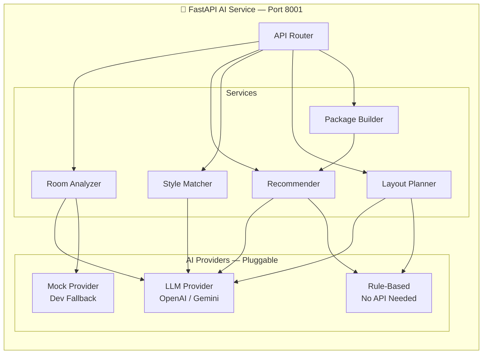

### FastAPI Endpoints

| Method | Endpoint | Description |
|:---|:---|:---|
| `POST` | `/analyze-room` | Analyze room image |
| `POST` | `/recommend-furniture` | Generate recommendations |
| `POST` | `/style-match` | Style compatibility score |
| `POST` | `/suggest-layout` | Optimal furniture layout |
| `POST` | `/room-package` | Complete room set |
| `GET` | `/health` | Service health check |

### Provider Interface (Strategy Pattern)

```python
from abc import ABC, abstractmethod

class AIProvider(ABC):
    """Pluggable AI provider — swap without changing business logic."""
    
    @abstractmethod
    async def analyze_image(self, image_path: str) -> RoomAnalysis: ...
    
    @abstractmethod
    async def get_recommendations(
        self, criteria: RecommendationCriteria, 
        catalog: list[FurnitureItem]
    ) -> list[Recommendation]: ...
    
    @abstractmethod
    async def compute_style_match(
        self, room_style: str, furniture_style: str
    ) -> StyleMatchResult: ...
    
    @abstractmethod
    async def suggest_layout(
        self, room: RoomSpec, furniture: list[FurnitureItem]
    ) -> LayoutSuggestion: ...

# Available implementations:
class OpenAIProvider(AIProvider): ...    # GPT-4o + GPT-4 Vision
class GeminiProvider(AIProvider): ...   # Gemini 2.0 Flash
class MockProvider(AIProvider): ...     # Dev fallback (realistic mock data)
class RuleBasedProvider(AIProvider): ... # Deterministic rules (no API key)
```

### Room Analysis Pipeline

```
📸 Input: Room Photo (JPG/PNG/WebP)
    │
    ▼
┌─────────────────────┐
│ 1. Image Validation  │  ← Format, size, is-a-room check
└──────────┬──────────┘
           │
           ▼
┌─────────────────────┐
│ 2. Vision Analysis   │  ← GPT-4V / Gemini Vision / CLIP
│                      │
│  Extracts:           │
│  • Room type         │  bedroom / living room / office
│  • Dominant colors   │  hex palette
│  • Design style      │  minimalist / modern / rustic
│  • Existing items    │  detected furniture types
│  • Lighting mood     │  bright / warm / dim
│  • Characteristics   │  spacious / compact / L-shaped
└──────────┬──────────┘
           │
           ▼
┌─────────────────────┐
│ 3. Recommendations   │  ← Map analysis → catalog items
│                      │
│  Considers:          │
│  • Style match       │  room style → furniture style
│  • Color harmony     │  room colors → furniture colors
│  • Category fit      │  room type → categories
│  • User preferences  │  history, favorites, budget
└──────────┬──────────┘
           │
           ▼
📊 Output: {
    room_type, detected_style, dominant_colors,
    lighting, characteristics, existing_furniture,
    recommended_categories, recommended_ids,
    confidence, reasoning
}
```

### Room Package Recommendation Pipeline

```
📦 Input: {room_type, dimensions, budget, style, colors}
    │
    ▼
┌─────────────────────────┐
│ 1. CATEGORY SELECTION    │  ← ⚙️ Deterministic
│    Living Room needs:    │
│    • Sofa (required)     │
│    • Coffee Table        │
│    • TV Stand            │
│    • Side Table          │
│    • Bookshelf (opt.)    │
│    • Decor (opt.)        │
└───────────┬─────────────┘
            │
            ▼
┌─────────────────────────┐
│ 2. BUDGET ALLOCATION     │  ← ⚙️ Deterministic
│    Total: ₱80,000        │
│    Sofa:       35-45%    │
│    Coffee Tbl:  8-12%    │
│    TV Stand:   12-18%    │
│    Side Table:  5-8%     │
│    Others:    remaining  │
└───────────┬─────────────┘
            │
            ▼
┌─────────────────────────┐
│ 3. DIMENSIONAL FILTER    │  ← ⚙️ Deterministic
│    Room: 400×500 cm      │
│    Max sofa width: ~300  │
│    Verify all items fit  │
└───────────┬─────────────┘
            │
            ▼
┌─────────────────────────┐
│ 4. AI STYLE SELECTION    │  ← 🤖 AI-Powered
│    Pick best-matching    │
│    items per category    │
│    for style + color     │
│    coherence             │
└───────────┬─────────────┘
            │
            ▼
📦 Output: {
    name: "Modern Minimalist Living Room Set",
    items: [...],
    total_cost, budget_remaining,
    style_coherence_score,
    space_utilization,
    reasoning
}
```

### AI Layout Suggestion Pipeline

```
🗺️ Input: {room_dimensions, furniture_with_dimensions}
    │
    ▼
┌──────────────────────────┐
│ 1. CONSTRAINT ANALYSIS    │  ← ⚙️ Deterministic
│    • Room boundaries      │
│    • Door/window zones    │
│    • Min clearance: 60cm  │
│    • Walking paths        │
└───────────┬──────────────┘
            │
            ▼
┌──────────────────────────┐
│ 2. LAYOUT RULES           │  ← ⚙️ Deterministic
│    • Sofa faces TV stand  │
│    • Coffee table → sofa  │
│    • Desk near window     │
│    • Bed against wall     │
└───────────┬──────────────┘
            │
            ▼
┌──────────────────────────┐
│ 3. AI OPTIMIZATION        │  ← 🤖 AI-Powered
│    • Aesthetic balance    │
│    • Flow optimization    │
│    • Multiple options     │
└───────────┬──────────────┘
            │
            ▼
🗺️ Output: {
    layouts: [
        { name: "Open Flow", positions: [...], score: 88 },
        { name: "Cozy Corner", positions: [...], score: 82 }
    ]
}
```

### Mock Provider Behavior

> [!caution] Development Mode
> When `AI_PROVIDER=mock`, all AI responses include `"_mock": true` and `"_notice": "AI service not configured. This is development data."` — the frontend displays a clear badge so users know the results are demo data.

---

## 7 — 3D Engine Architecture

### Component Architecture

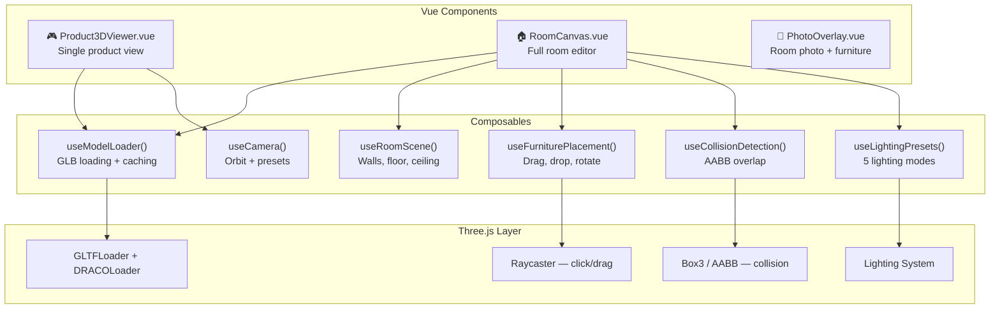

### Product 3D Viewer

```
┌─────────────────────────────────────┐
│         Product 3D Viewer           │
│                                     │
│    ┌───────────────────────┐        │
│    │                       │        │
│    │    [ 3D Furniture ]   │        │
│    │       ↻ Rotate        │        │
│    │       🔍 Zoom         │        │
│    │       ✋ Pan           │        │
│    │                       │        │
│    └───────────────────────┘        │
│                                     │
│    [ Front ] [ Side ] [ Top ]       │
│    [ Reset Camera ]                 │
│                                     │
│    📏 220W × 85H × 90D cm          │
└─────────────────────────────────────┘
```

**Features:**
- OrbitControls — rotate, zoom, pan
- Preset camera buttons — front, side, top, 3/4 view
- Auto-rotate toggle
- Dimension labels overlaid
- Loading progress indicator
- Model cached after first load

### Room Planner Layout

```
┌──────────────────────────────────────────────────────────────┐
│  🏠 Room Planner: "My Living Room"                 [💾 Save]│
├──────────┬───────────────────────────────────────────────────┤
│          │                                                   │
│ 🔧 Tools │              3D Room View                         │
│          │         ┌─────────────────────┐                   │
│ [+ Add]  │         │    ┌──┐             │                   │
│ [↔ Move] │         │    │TV│             │                   │
│ [↻ Rot]  │         │    └──┘             │                   │
│ [🗑 Del] │         │                     │                   │
│ [📋 Dup] │         │  ┌────────┐  ┌──┐   │                   │
│          │         │  │  Sofa  │  │T │   │                   │
│ ──────── │         │  └────────┘  └──┘   │                   │
│          │         │         ┌────┐      │                   │
│ 💡 Light │         │         │Coff│      │                   │
│ [☀ Day]  │         │         └────┘      │                   │
│ [🌅 Gold]│         └─────────────────────┘                   │
│ [🌙 Eve] │                                                   │
│ [💡 Show]│  View: [2D Top-Down] [3D Perspective]             │
│ [🌃 Nite]│                                                   │
│ ──────── │  ──────────────────────────────────────────────── │
│          │                                                   │
│ 📏 Room  │  Compatibility: ██████████░░ 85% ✅ GOOD FIT      │
│ 400×500  │  Budget: ₱39,000 / ₱50,000  (₱11,000 remaining) │
│          │                                                   │
├──────────┴───────────────────────────────────────────────────┤
│  Furniture: Sofa · Coffee Table · TV Stand · Chair           │
└──────────────────────────────────────────────────────────────┘
```

### 💡 Lighting Presets

| Preset | Ambient | Directional / Point | Color | Feel |
|:---|:---|:---|:---|:---|
| ☀️ **Daylight** | 0.8 | Dir: 1.0 | `#FFFAF0` | Bright, neutral |
| 🌅 **Golden Hour** | 0.5 | Dir: 0.8 | `#FFD700` | Warm, golden |
| 🌙 **Evening** | 0.3 | Point: 0.6 | `#FFA500` | Dim, cozy |
| 💡 **Showroom** | 1.0 | Dir: 0.5 | `#FFFFFF` | Even, bright |
| 🌃 **Night** | 0.15 | Spot: 0.4 | `#4169E1` | Very dim, accent |

### Space Compatibility Algorithm

> [!info] This is 100% deterministic — no AI involved.

```
SPACE COMPATIBILITY SCORING
════════════════════════════

Input:
  room = { width_cm, length_cm }
  furniture[] = { width_cm, depth_cm, position_x, position_y, rotation }

━━━━━━━━━━━━━━━━━━━━━━━━━━

STEP 1: BOUNDARY CHECK               (30 points max)
  For each item:
    → Calculate bounding box after rotation
    → Check: fully within room boundaries?
    → FAIL (instant 0 total) if ANY item extends beyond room
  Score: 30 if all pass

STEP 2: OVERLAP CHECK                 (25 points max)
  For each pair of items:
    → AABB intersection test
    → FAIL (instant 0 total) if ANY items overlap
  Score: 25 if no overlaps

STEP 3: WALL CLEARANCE                (15 points max)
  For each item:
    → Distance to nearest wall
    → Ideal: ≥ 10 cm (unless against-wall furniture type)
  Score: proportional to clearance quality

STEP 4: WALKING SPACE                 (20 points max)
  → walking_ratio = (room_area - furniture_area) / room_area
  → ≥ 50% open → 20 pts
  → 40-50%     → 15 pts
  → 30-40%     → 10 pts
  → 20-30%     →  5 pts
  → < 20%      →  0 pts

STEP 5: CLEARANCE BETWEEN ITEMS       (10 points max)
  For each adjacent pair:
    → Minimum gap between items
    → Ideal: ≥ 60 cm (walking clearance)
  Score: proportional to gap adequacy

━━━━━━━━━━━━━━━━━━━━━━━━━━

TOTAL = Step1 + Step2 + Step3 + Step4 + Step5  (max 100)

VERDICT:
  90-100  →  ✅ "EXCELLENT FIT"
  70-89   →  ✅ "GOOD FIT"
  50-69   →  ⚠️ "LIMITED SPACE"
  30-49   →  ⚠️ "TIGHT FIT"
  0-29    →  ❌ "DOES NOT FIT"

SPECIAL: If Step 1 or Step 2 FAIL → automatic "DOES NOT FIT" (0 score)
```

### GLB Asset Requirements

| Property | Requirement |
|:---|:---|
| **Format** | GLB (binary glTF 2.0) |
| **Max file size** | 5 MB (target: 1–2 MB) |
| **Max polygons** | 50,000 (target: 10K–30K) |
| **Textures** | Max 2048×2048, prefer 1024 |
| **Materials** | PBR Metallic-Roughness |
| **Origin** | Center-bottom (floor level) |
| **Scale** | 1 unit = 1 meter |
| **Up axis** | Y-up |
| **Compression** | Draco recommended |
| **Naming** | `{style}-{type}-{id}.glb` |

---

## 8 — Frontend Architecture

### Route Structure

```
PUBLIC
  /                          → Home
  /catalog                   → Furniture Catalog
  /catalog/:slug             → Category View
  /furniture/:id             → Product Details
  /login                     → Login
  /register                  → Register

CUSTOMER (customer role required)
  /dashboard                 → Customer Dashboard
  /rooms                     → My Room Designs
  /rooms/new                 → Create Room
  /rooms/:id                 → Room Planner Editor
  /rooms/:id/photo           → Photo Visualization
  /favorites                 → My Favorites
  /compare                   → Compare Furniture
  /recommendations           → AI Recommendations
  /orders                    → My Orders
  /profile                   → Edit Profile

MANAGEMENT PORTAL (Protected by EnsureRole / Vue Router Navigation Guards)
  /admin                     → Unified Admin/Staff Shell (sidebar items filtered by role)

  🎨 Content Manager & Above (`content_manager`, `admin`, `superadmin`):
  /admin/furniture            → Furniture Catalog Management
  /admin/furniture/new        → Add Furniture Item & Specs
  /admin/furniture/:id/edit   → Edit Furniture Details
  /admin/furniture/:id/model  → 3D GLB Model Uploader & Calibrator
  /admin/categories           → Category & Style Taxonomy Management

  📦 Staff & Above (`staff`, `admin`, `superadmin`):
  /admin/orders               → Order Processing & Status Updates
  /admin/inventory            → Warehouse Stock Management & Adjustments

  👔 Admin & Superadmin (`admin`, `superadmin`):
  /admin/dashboard            → Executive Dashboard & Sales KPI
  /admin/customers            → Customer Accounts & Order History
  /admin/analytics            → Room Analytics & Product Trends

  👑 Superadmin Only (`superadmin`):
  /admin/users                → Staff & Admin User Accounts (RBAC)
  /admin/audit-logs           → Security & Activity Audit Trail
  /admin/settings             → AI API Configuration & System Settings
```

### Component Hierarchy

```
App.vue
├── layouts/
│   ├── PublicLayout.vue
│   ├── CustomerLayout.vue
│   └── AdminLayout.vue
│
├── components/shared/           ← Reusable across all features
│   ├── BaseButton.vue
│   ├── BaseInput.vue
│   ├── BaseSelect.vue
│   ├── BaseModal.vue
│   ├── BaseCard.vue
│   ├── BaseLoader.vue
│   ├── BasePagination.vue
│   ├── BaseBadge.vue
│   ├── BaseToast.vue
│   ├── PriceDisplay.vue
│   ├── DimensionDisplay.vue
│   └── AIIndicator.vue          ← Shows AI vs mock status
│
├── features/catalog/
│   ├── components/
│   │   ├── FurnitureCard.vue
│   │   ├── FurnitureGrid.vue
│   │   ├── CatalogFilters.vue
│   │   ├── CatalogSearch.vue
│   │   ├── CategoryNav.vue
│   │   └── FurnitureQuickView.vue
│   ├── composables/useFurnitureFilters.ts
│   ├── stores/catalogStore.ts
│   └── api/furnitureApi.ts
│
├── features/product/
│   ├── components/
│   │   ├── ProductGallery.vue
│   │   ├── ProductInfo.vue
│   │   ├── ProductDimensions.vue
│   │   ├── Product3DViewer.vue
│   │   ├── ProductActions.vue
│   │   └── RelatedProducts.vue
│   └── ...
│
├── features/room-planner/
│   ├── components/
│   │   ├── RoomCanvas.vue
│   │   ├── RoomFloor.vue
│   │   ├── RoomWalls.vue
│   │   ├── FurnitureObject.vue
│   │   ├── RoomToolbar.vue
│   │   ├── FurniturePicker.vue
│   │   ├── CompatibilityPanel.vue
│   │   ├── BudgetPanel.vue
│   │   ├── LightingControls.vue
│   │   ├── RoomSettings.vue
│   │   └── LayoutSuggestions.vue
│   ├── composables/
│   │   ├── useRoomScene.ts
│   │   ├── useFurniturePlacement.ts
│   │   ├── useCollisionDetection.ts
│   │   ├── useSpaceCompatibility.ts
│   │   ├── useLightingPresets.ts
│   │   └── useModelLoader.ts
│   └── stores/roomPlannerStore.ts
│
├── features/ai/
│   ├── components/
│   │   ├── RoomAnalysisResult.vue
│   │   ├── RecommendationCard.vue
│   │   ├── StyleMatchMeter.vue
│   │   ├── RoomPackageCard.vue
│   │   └── AIStatusBadge.vue
│   ├── composables/useAIService.ts
│   └── api/aiApi.ts
│
├── features/compare/
├── features/favorites/
├── features/orders/
├── features/auth/
└── features/admin/
```

### State Management (Pinia)

| Store | Scope | Key State |
|:---|:---|:---|
| `useAuthStore` | Global | user, isAuthenticated, role, permissions, hasRole(), can() |
| `useCatalogStore` | Feature | furniture list, filters, pagination |
| `useRoomPlannerStore` | Feature | room dims, furniture placements, compatibility |
| `useFavoritesStore` | Feature | favorite IDs |
| `useCompareStore` | Feature | compared IDs (max 4) |
| `useCartStore` | Feature | order items |
| `useUIStore` | Global | toasts, modals, loading |

---

## 9 — Backend Architecture

### Laravel Layer Structure

```
app/
├── Http/
│   ├── Controllers/
│   │   ├── Api/V1/                    ← Public/Customer endpoints
│   │   │   ├── AuthController.php
│   │   │   ├── FurnitureController.php
│   │   │   ├── CategoryController.php
│   │   │   ├── RoomProjectController.php
│   │   │   ├── RoomFurnitureController.php
│   │   │   ├── FavoriteController.php
│   │   │   ├── ComparisonController.php
│   │   │   ├── OrderController.php
│   │   │   ├── AIProxyController.php
│   │   │   └── ProfileController.php
│   │   └── Admin/                     ← Management endpoints
│   │       ├── DashboardController.php
│   │       ├── FurnitureManagementController.php
│   │       ├── CategoryManagementController.php
│   │       ├── InventoryController.php
│   │       ├── OrderManagementController.php
│   │       ├── CustomerController.php
│   │       ├── AnalyticsController.php
│   │       ├── UserController.php             ← Superadmin staff & role mgmt
│   │       └── SystemSettingsController.php   ← Superadmin system & AI config
│   │
│   ├── Requests/                      ← FormRequest validation
│   ├── Resources/                     ← API Resources / DTOs
│   └── Middleware/
│       ├── EnsureRole.php             ← Multi-role authorization (role:...)
│       ├── EnsureAdmin.php            ← Legacy/convenience alias
│       └── TrackActivity.php
│
├── Models/                            ← 15+ Eloquent models
├── Services/                          ← Business logic
│   ├── FurnitureService.php
│   ├── RoomProjectService.php
│   ├── SpaceCompatibilityService.php  ← The deterministic algorithm
│   ├── BudgetService.php
│   ├── AIServiceClient.php            ← HTTP proxy to Python
│   ├── OrderService.php
│   ├── FileUploadService.php
│   └── AnalyticsService.php
│
├── Actions/                           ← Single-purpose classes
│   ├── Furniture/
│   ├── Room/
│   └── Order/
│
├── Enums/
│   ├── AvailabilityStatus.php
│   ├── OrderStatus.php
│   ├── RoomType.php
│   ├── FurnitureStyle.php
│   └── UserRole.php
│
└── Exceptions/
    ├── AIServiceUnavailableException.php
    └── InsufficientStockException.php
```

### AIServiceClient (Laravel → Python Proxy)

```php
class AIServiceClient
{
    /**
     * Browser NEVER calls Python directly.
     * Laravel proxies all AI requests.
     */
    
    public function analyzeRoom(string $imagePath, ?string $hint): ?RoomAnalysisDTO
    {
        try {
            $response = Http::timeout(30)
                ->attach('image', file_get_contents($imagePath), basename($imagePath))
                ->post($this->baseUrl . '/analyze-room', [
                    'room_type_hint' => $hint,
                ]);
            
            return $response->successful()
                ? RoomAnalysisDTO::fromArray($response->json())
                : null;
                
        } catch (ConnectionException $e) {
            Log::warning('AI service unavailable', ['error' => $e->getMessage()]);
            return null; // Graceful degradation
        }
    }
    
    public function isAvailable(): bool { /* health check */ }
}
```

### UserRole Enum

```php
namespace App\Enums;

enum UserRole: string
{
    case SUPERADMIN      = 'superadmin';
    case ADMIN           = 'admin';
    case STAFF           = 'staff';
    case CONTENT_MANAGER = 'content_manager';
    case CUSTOMER        = 'customer';

    public function label(): string
    {
        return match($this) {
            self::SUPERADMIN      => 'Superadmin',
            self::ADMIN           => 'Admin',
            self::STAFF           => 'Staff',
            self::CONTENT_MANAGER => 'Content Manager',
            self::CUSTOMER        => 'Customer',
        };
    }
}
```

### EnsureRole Middleware

```php
namespace App\Http\Middleware;

use Closure;
use Illuminate\Http\Request;
use Symfony\Component\HttpFoundation\Response;

class EnsureRole
{
    /**
     * Handle an incoming request.
     * Usage in routes: middleware('role:superadmin,admin')
     */
    public function handle(Request $request, Closure $next, string ...$roles): Response
    {
        $user = $request->user();

        if (!$user || !in_array($user->role->slug, $roles, true)) {
            return response()->json([
                'success' => false,
                'message' => 'Unauthorized: Insufficient role permissions for this action.',
                'code'    => 'ERR_ROLE_UNAUTHORIZED',
            ], Response::HTTP_FORBIDDEN); // 403
        }

        return $next($request);
    }
}
```

---

## 10 — Security Plan

### Authentication & Authorization

| Layer | Implementation |
|:---|:---|
| **Authentication** | Laravel Sanctum cookie-based SPA auth |
| **CSRF** | Sanctum CSRF token cookie flow |
| **Password Hashing** | bcrypt (Laravel default) |
| **Sessions** | Server-side (database driver) |
| **Role-Based Access (RBAC)** | `EnsureRole` middleware (`role:slug1,slug2`) + Model Policies |
| **Route Protection** | `auth:sanctum` on protected routes |

### 🛡️ Role-Based Access Control (RBAC) Matrix

| Module / Action | 👑 Superadmin | 👔 Admin | 📦 Staff | 🎨 Content Manager | 👤 Customer |
|:---|:---:|:---:|:---:|:---:|:---:|
| **Staff & User Role Management** | ✅ Full | ❌ | ❌ | ❌ | ❌ |
| **System Settings & AI API Keys** | ✅ Full | ❌ | ❌ | ❌ | ❌ |
| **Audit Logs & Security Trail** | ✅ Full | 👁️ View Only | ❌ | ❌ | ❌ |
| **Executive KPI & Sales Analytics** | ✅ Full | ✅ Full | ❌ | ❌ | ❌ |
| **Customer Profile Management** | ✅ Full | ✅ Full | 👁️ View Only | ❌ | 👤 Own Only |
| **Orders: View All** | ✅ Full | ✅ Full | ✅ Full | ❌ | 👤 Own Only |
| **Orders: Update Status** | ✅ Full | ✅ Full | ✅ Full | ❌ | ❌ (Cancel only) |
| **Inventory: View Stock** | ✅ Full | ✅ Full | ✅ Full | 👁️ View Only | 👁️ Stock Status |
| **Inventory: Adjust Stock Levels** | ✅ Full | ✅ Full | ✅ Full | ❌ | ❌ |
| **Furniture: Create / Edit / Delete** | ✅ Full | ✅ Full | ❌ | ✅ Full | ❌ |
| **3D GLB Model: Upload & Calibrate** | ✅ Full | ✅ Full | ❌ | ✅ Full | ❌ |
| **Categories & Style Taxonomy** | ✅ Full | ✅ Full | ❌ | ✅ Full | 👁️ View Only |
| **3D Room Planner & Space Engine** | 🧪 Test Mode | 🧪 Test Mode | 👁️ View Shared | 🧪 Test Mode | ✅ Full Access |
| **AI Room Analysis & Suggestions** | 🧪 Test Mode | 🧪 Test Mode | ❌ | 🧪 Test Mode | ✅ Full Access |

### Threat Mitigation

| Threat | Mitigation |
|:---|:---|
| **SQL Injection** | Eloquent ORM (parameterized queries only) |
| **XSS** | Vue template auto-escaping + CSP headers |
| **CSRF** | Sanctum CSRF cookie + middleware |
| **Mass Assignment** | `$fillable` on all models |
| **Invalid Input** | FormRequest on every POST/PUT |
| **File Upload Attacks** | MIME + extension + size validation |
| **Rate Abuse** | `throttle:60,1` (AI: `throttle:10,1`) |
| **Credential Exposure** | AI keys in `.env`, proxied via Laravel |

### File Upload Validation

```php
$rules = [
    'image' => ['file', 'max:10240', 'mimes:jpg,jpeg,png,webp'],
    'model' => ['file', 'max:20480', 'mimes:glb'],
];

// Additional measures:
// ✅ Sanitize filenames
// ✅ Store with hashed names
// ✅ Store outside web root
// ✅ Validate actual MIME (not just extension)
// ❌ No executable uploads ever
```

---

## 11 — Folder Structure

```
new_project/
│
├── 📁 backend/                        ← Laravel 11 API
│   ├── app/
│   │   ├── Actions/
│   │   ├── Enums/
│   │   ├── Exceptions/
│   │   ├── Http/
│   │   │   ├── Controllers/Api/V1/
│   │   │   ├── Controllers/Admin/
│   │   │   ├── Middleware/
│   │   │   ├── Requests/
│   │   │   └── Resources/
│   │   ├── Models/
│   │   ├── Providers/
│   │   └── Services/
│   ├── config/
│   ├── database/
│   │   ├── factories/
│   │   ├── migrations/
│   │   └── seeders/
│   ├── routes/
│   │   ├── api.php
│   │   └── web.php
│   ├── storage/app/public/
│   │   ├── furniture/images/
│   │   ├── furniture/models/
│   │   └── rooms/images/
│   ├── tests/Feature/ & Unit/
│   ├── .env.example
│   └── composer.json
│
├── 📁 frontend/                       ← Vue 3 + TypeScript SPA
│   ├── public/
│   │   ├── draco/                     ← Self-hosted Draco decoder
│   │   └── models/                    ← Dev placeholder GLBs
│   ├── src/
│   │   ├── assets/
│   │   ├── components/                ← Shared BaseComponents
│   │   ├── composables/               ← Global composables
│   │   ├── features/                  ← Feature modules
│   │   │   ├── auth/
│   │   │   ├── catalog/
│   │   │   ├── product/
│   │   │   ├── room-planner/
│   │   │   ├── ai/
│   │   │   ├── compare/
│   │   │   ├── favorites/
│   │   │   ├── orders/
│   │   │   └── admin/
│   │   ├── layouts/
│   │   ├── pages/
│   │   ├── router/
│   │   ├── stores/
│   │   ├── styles/main.css
│   │   ├── types/
│   │   ├── utils/
│   │   ├── App.vue
│   │   └── main.ts
│   ├── index.html
│   ├── package.json
│   ├── tailwind.config.ts
│   ├── tsconfig.json
│   └── vite.config.ts
│
├── 📁 ai-service/                     ← Python FastAPI
│   ├── app/
│   │   ├── api/routes/
│   │   │   ├── room_analysis.py
│   │   │   ├── recommendations.py
│   │   │   ├── style_match.py
│   │   │   ├── layout.py
│   │   │   └── health.py
│   │   ├── core/config.py
│   │   ├── models/                    ← Pydantic schemas
│   │   ├── services/
│   │   │   ├── providers/
│   │   │   │   ├── base.py
│   │   │   │   ├── openai_provider.py
│   │   │   │   ├── gemini_provider.py
│   │   │   │   ├── mock_provider.py
│   │   │   │   └── rule_based.py
│   │   │   ├── room_analyzer.py
│   │   │   ├── recommender.py
│   │   │   ├── style_matcher.py
│   │   │   ├── layout_planner.py
│   │   │   └── package_builder.py
│   │   ├── utils/
│   │   └── main.py
│   ├── tests/
│   ├── requirements.txt
│   └── .env.example
│
├── 📁 docs/
│   ├── setup.md
│   ├── api-reference.md
│   ├── blender-asset-guide.md
│   ├── ai-service-guide.md
│   └── deployment.md
│
├── 📁 assets/
│   ├── blender/                       ← .blend source files
│   └── models/                        ← Exported .glb files
│
└── README.md
```

---

## 12 — Feature Breakdown

### Feature Matrix

| # | Feature | Priority | Phase | 🤖 AI? | ⚙️ Deterministic? |
|:---|:---|:---|:---|:---|:---|
| F1 | Furniture Catalog | ==Critical== | 1–2 | ❌ | ✅ |
| F2 | Product Details + 3D Viewer | ==Critical== | 2–3 | ❌ | ✅ |
| F3 | 3D Room Planner | ==Critical== | 4 | ❌ | ✅ |
| F4 | Space Compatibility Engine | ==Critical== | 4 | ❌ | ✅ Algorithm |
| F5 | Room Photo Visualization | High | 6 | Partial | Partial |
| F6 | AI Room Analysis | High | 5–6 | ✅ | ❌ |
| F7 | AI Furniture Recommendations | High | 5 | ✅ | Hybrid |
| F8 | AI Style Matching | High | 6 | ✅ | ❌ |
| F9 | Budget Planner | Medium | 4 | ❌ | ✅ |
| F10 | Multi-Furniture Room Design | ==Critical== | 4 | ❌ | ✅ |
| F11 | Furniture Comparison | Medium | 2 | ❌ | ✅ |
| F12 | Favorites & Saved Designs | Medium | 2–4 | ❌ | ✅ |
| F13 | Reservation / Order | Medium | 7 | ❌ | ✅ |
| F14 | Lighting Preview | Medium | 4 | ❌ | ✅ |
| F15 | AI Layout Suggestions | High | 6 | ✅ | Hybrid |
| F16 | Room Package Recommendations | High | 5 | ✅ | Hybrid |
| F17 | Admin Dashboard & Analytics | Medium | 7 | ❌ | ✅ |

### What Makes This System Special

> [!tip] Beyond a Normal Furniture Catalog
> 
> 1. **🏠 Room Planner** — *"Place a 220cm sofa in your 400×500cm room"*
> 2. **📏 Space Compatibility** — *"92% compatibility — fits with good clearance"*
> 3. **📸 AI Room Analysis** — *"Upload photo → Modern Minimalist detected → matching furniture"*
> 4. **📦 Room Packages** — *"₱80K budget → Sofa + Table + TV Stand + Bookshelf = ₱72,500 matched set"*
> 5. **🗺️ AI Layout Suggestions** — *"3 optimal arrangements for your furniture"*
> 6. **💡 Lighting Preview** — *"See furniture under daylight, evening, warm light"*
> 7. **🚧 Collision Detection** — *"⚠️ Sofa overlaps with coffee table"*
> 8. **💰 Budget Planner** — *"₱39,000 of ₱50,000 used. ₱11,000 left"*

---

## 13 — Development Roadmap (8 Phases)

### Timeline Overview

| Phase | Duration | Weeks |
|:---|:---|:---|
| Phase 1 — Foundation | ~14 days | Week 1–2 |
| Phase 2 — Catalog & Management | ~10 days | Week 3–4 |
| Phase 3 — 3D Integration | ~7 days | Week 5 |
| Phase 4 — Room Planner | ~15 days | Week 6–8 |
| Phase 5 — AI Service | ~11 days | Week 9–10 |
| Phase 6 — Advanced AI Features | ~9 days | Week 11–12 |
| Phase 7 — Orders & Admin | ~8 days | Week 12–13 |
| Phase 8 — Polish & Testing | ~12 days | Week 14–16 |
| **Total Estimated** | **~86 days** | **~3 months** |

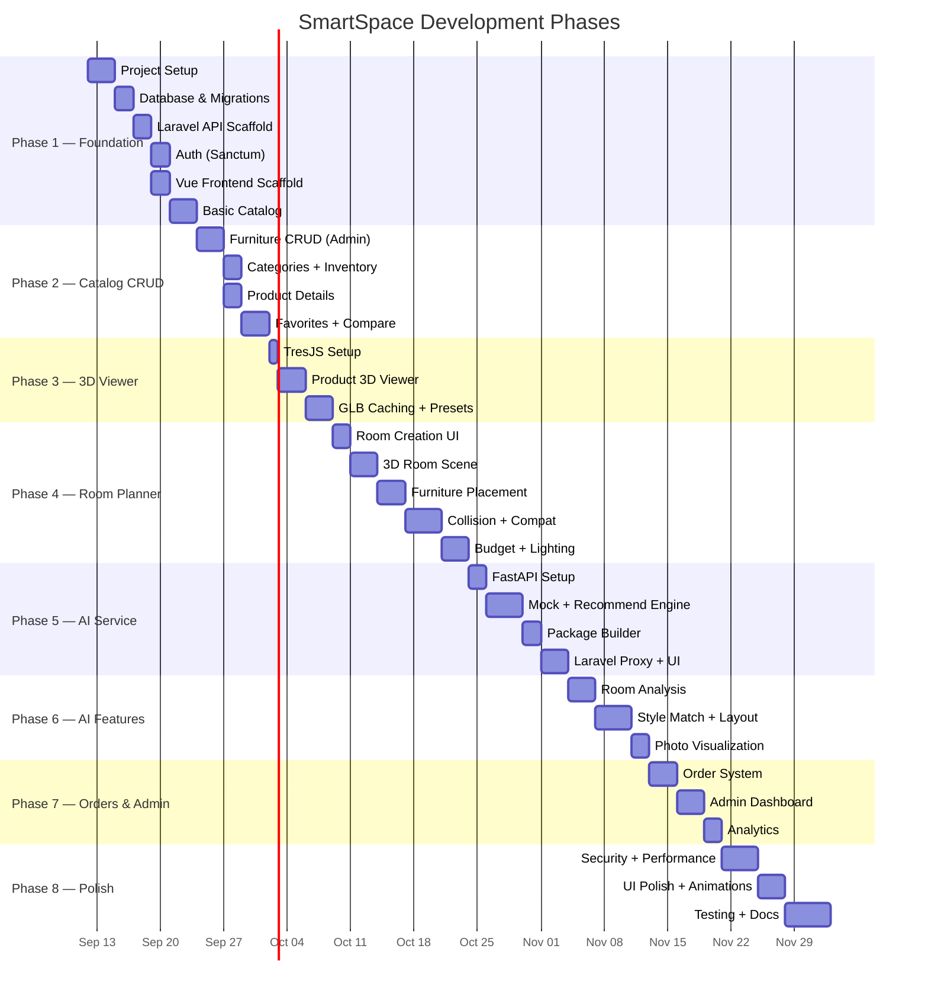

---

### Phase 1 — Foundation
#phase/1

> [!abstract] Goal
> Standing project with working auth, database, and basic catalog page.

| Task | Description |
|:---|:---|
| 1.1 | Initialize Laravel 11 project |
| 1.2 | Initialize Vue 3 + Vite + TypeScript + Tailwind 4 |
| 1.3 | Create all 16+ database migrations |
| 1.4 | Create Eloquent models with relationships |
| 1.5 | Create seeders (5 roles, 5 test users, categories, 30+ furniture items) |
| 1.6 | Configure Sanctum for SPA auth |
| 1.7 | Build auth endpoints (register, login, logout, profile) |
| 1.8 | Build Vue auth pages (login, register) |
| 1.9 | Create shared BaseComponents |
| 1.10 | Build basic catalog page (grid, pagination) |
| 1.11 | Configure Vue Router with 5-role RBAC guards |

**Deliverables:**
- [x] User can register and login
- [x] Catalog shows furniture from DB
- [x] Basic filtering + pagination
- [x] 5 RBAC roles (Superadmin, Admin, Staff, Content Manager, Customer)
- [x] Dynamic navigation guards in Vue Router

---

### Phase 2 — Catalog & Management
#phase/2

> [!abstract] Goal
> Complete CRUD, product details, favorites, comparison.

| Task | Description |
|:---|:---|
| 2.1 | Admin furniture CRUD |
| 2.2 | Multi-image upload |
| 2.3 | GLB model upload |
| 2.4 | Category management |
| 2.5 | Inventory management |
| 2.6 | Product details page |
| 2.7 | Advanced filters (price, size, style, color, material) |
| 2.8 | Full-text search |
| 2.9 | Favorites system |
| 2.10 | Comparison system (up to 4 items) |

---

### Phase 3 — 3D Integration
#phase/3

> [!abstract] Goal
> Interactive 3D product viewer using TresJS.

| Task | Description |
|:---|:---|
| 3.1 | Install TresJS + Cientos + Three.js |
| 3.2 | Create `Product3DViewer` component |
| 3.3 | GLB loading with Draco decompression |
| 3.4 | OrbitControls (rotate, zoom, pan) |
| 3.5 | Camera presets (front, side, top, 3/4) |
| 3.6 | Loading progress indicator |
| 3.7 | Model caching composable |
| 3.8 | Integrate into product details page |
| 3.9 | Create sample placeholder GLB models |

---

### Phase 4 — Room Planner
#phase/4

> [!abstract] Goal
> Full 3D room editor with placement, collision, compatibility, lighting, budget.

| Task | Description |
|:---|:---|
| 4.1 | Room creation form (dimensions, type, style) |
| 4.2 | 3D room scene (floor, walls, ceiling) |
| 4.3 | Furniture picker sidebar |
| 4.4 | Add furniture (GLB at correct scale) |
| 4.5 | Drag to move (constrained to room) |
| 4.6 | Rotate furniture (Y-axis) |
| 4.7 | Duplicate and remove |
| 4.8 | AABB collision detection |
| 4.9 | Space compatibility algorithm |
| 4.10 | Compatibility panel |
| 4.11 | Budget panel |
| 4.12 | 5 lighting presets |
| 4.13 | 2D top-down view toggle |
| 4.14 | Save/load room designs |
| 4.15 | Room image upload |

---

### Phase 5 — AI Service
#phase/5

> [!abstract] Goal
> FastAPI AI service with recommendations and room packages.

| Task | Description |
|:---|:---|
| 5.1 | Initialize FastAPI project |
| 5.2 | Pydantic request/response models |
| 5.3 | AIProvider interface (strategy pattern) |
| 5.4 | MockProvider (dev fallback) |
| 5.5 | Rule-based recommendation engine |
| 5.6 | Room package builder |
| 5.7 | Laravel `AIServiceClient` |
| 5.8 | `AIProxyController` |
| 5.9 | Recommendation UI (Vue) |
| 5.10 | Room package UI (Vue) |
| 5.11 | Health check + graceful degradation |

---

### Phase 6 — Advanced AI Features
#phase/6

> [!abstract] Goal
> Room analysis, style matching, layout suggestions, photo visualization.

| Task | Description |
|:---|:---|
| 6.1 | Room photo upload + storage |
| 6.2 | Room analysis endpoint |
| 6.3 | Real AI provider (OpenAI / Gemini) |
| 6.4 | Room analysis results UI |
| 6.5 | Style matching endpoint + UI |
| 6.6 | Layout suggestion endpoint |
| 6.7 | Layout visualization in planner |
| 6.8 | Photo overlay visualization |
| 6.9 | AI status indicator |
| 6.10 | Clear AI vs deterministic labeling |

---

### Phase 7 — Orders & Admin
#phase/7

> [!abstract] Goal
> Simple order/reservation system + admin dashboard.

| Task | Description |
|:---|:---|
| 7.1 | Order creation workflow |
| 7.2 | Order review page |
| 7.3 | Order status tracking |
| 7.4 | Admin order management |
| 7.5 | Admin dashboard (stats, charts) |
| 7.6 | Customer management |
| 7.7 | Room/design analytics |
| 7.8 | Furniture popularity analytics |

---

### Phase 8 — Polish & Testing
#phase/8

> [!abstract] Goal
> Production-quality finish.

| Task | Description |
|:---|:---|
| 8.1 | Security audit (CSRF, XSS, SQLi, uploads) |
| 8.2 | Rate limiting |
| 8.3 | 3D performance (lazy loading, LOD) |
| 8.4 | Image optimization (thumbnails, WebP) |
| 8.5 | UI animations & transitions |
| 8.6 | Responsive design (mobile, tablet) |
| 8.7 | Error handling & toast feedback |
| 8.8 | PHPUnit API tests |
| 8.9 | Vue component tests (Vitest) |
| 8.10 | Python AI service tests (pytest) |
| 8.11 | E2E tests |
| 8.12 | Complete documentation |

---

## 14 — Environment & Configuration

### Backend `.env`

```env
# Application
APP_NAME=SmartSpace
APP_ENV=local
APP_KEY=
APP_DEBUG=true
APP_URL=http://localhost:8000

# Database
DB_CONNECTION=mysql
DB_HOST=127.0.0.1
DB_PORT=3306
DB_DATABASE=SmartSpace
DB_USERNAME=root
DB_PASSWORD=

# Sanctum
SANCTUM_STATEFUL_DOMAINS=localhost:5173,localhost:3000
SESSION_DOMAIN=localhost
SESSION_DRIVER=database

# CORS
CORS_ALLOWED_ORIGINS=http://localhost:5173

# File Storage
FILESYSTEM_DISK=public
MAX_IMAGE_SIZE_KB=10240
MAX_MODEL_SIZE_KB=20480
ALLOWED_IMAGE_TYPES=jpg,jpeg,png,webp
ALLOWED_MODEL_TYPES=glb

# AI Service
AI_SERVICE_URL=http://localhost:8001
AI_SERVICE_TIMEOUT=30
AI_SERVICE_ENABLED=true

# Rate Limiting
API_RATE_LIMIT=60
AI_RATE_LIMIT=10
```

### Frontend `.env`

```env
VITE_API_BASE_URL=http://localhost:8000
VITE_APP_NAME=SmartSpace
VITE_DRACO_DECODER_PATH=/draco/
```

### AI Service `.env`

```env
# Server
HOST=0.0.0.0
PORT=8001
DEBUG=true
ENVIRONMENT=development

# AI Provider: openai | gemini | mock
AI_PROVIDER=mock

# OpenAI (when AI_PROVIDER=openai)
OPENAI_API_KEY=sk-...
OPENAI_MODEL=gpt-4o
OPENAI_VISION_MODEL=gpt-4o

# Google Gemini (when AI_PROVIDER=gemini)
GEMINI_API_KEY=
GEMINI_MODEL=gemini-2.0-flash

# Internal Auth (shared secret with Laravel)
SERVICE_API_KEY=your-internal-service-key

# Limits
MAX_IMAGE_SIZE_MB=10
MAX_CATALOG_ITEMS_PER_REQUEST=500
```

---

## 15 — Deployment & DevOps

### Local Development

```bash
# 1️⃣ Backend (Laravel)
cd backend
composer install
cp .env.example .env
php artisan key:generate
php artisan migrate --seed
php artisan storage:link
php artisan serve --port=8000

# 2️⃣ Frontend (Vue)
cd frontend
npm install
cp .env.example .env
npm run dev  # → http://localhost:5173

# 3️⃣ AI Service (Python)
cd ai-service
python -m venv venv
venv\Scripts\activate          # Windows
pip install -r requirements.txt
cp .env.example .env
uvicorn app.main:app --host 0.0.0.0 --port 8001 --reload
```

### Production

| Concern | Recommendation |
|:---|:---|
| **Web Server** | Nginx + PHP-FPM |
| **SSL** | Required (Let's Encrypt) |
| **Database** | MySQL 8 + connection pooling |
| **File Storage** | S3-compatible for production |
| **AI Service** | Docker container, separate server |
| **Caching** | Redis (session, cache, queue) |
| **Queue** | Laravel Queue for async AI |
| **CDN** | Static assets + GLB models via CDN |
| **Monitoring** | Laravel Telescope (dev), Sentry (prod) |
| **Backups** | Automated daily DB backups |

---

## 16 — Testing Strategy

### Backend (PHPUnit)

```
tests/
├── Feature/
│   ├── Auth/RegistrationTest.php
│   ├── Auth/LoginTest.php
│   ├── Furniture/FurnitureListTest.php
│   ├── Furniture/FurnitureCreateTest.php
│   ├── Room/RoomProjectTest.php
│   ├── Room/SpaceCompatibilityTest.php
│   ├── Order/OrderTest.php
│   └── AI/AIProxyTest.php
└── Unit/
    ├── SpaceCompatibilityServiceTest.php
    ├── BudgetServiceTest.php
    └── FileUploadServiceTest.php
```

### Frontend (Vitest + Playwright)

| Type | Tool | Scope |
|:---|:---|:---|
| Unit | Vitest | Composables, utilities, stores |
| Component | Vitest + @vue/test-utils | Vue component rendering |
| E2E | Playwright | Full user flows |

### AI Service (Pytest)

```
tests/
├── test_room_analysis.py
├── test_recommendations.py
├── test_style_match.py
├── test_mock_provider.py
└── test_health.py
```

### Run Commands

```bash
# Backend
cd backend && php artisan test

# Frontend
cd frontend && npm run test

# AI Service
cd ai-service && python -m pytest

# Frontend build check
cd frontend && npm run build
```

---

## 17 — Blender Asset Pipeline

### Workflow

```
Step 1: MODEL 🎨
  → Create/import furniture model in Blender
  → Target: 10K–30K faces (max 50K)
  → Origin: center-bottom (floor contact)
  → Scale: 1 Blender unit = 1 meter

Step 2: MATERIALS 🖌️
  → Principled BSDF (PBR)
  → Base Color, Roughness, Metallic, Normal
  → Textures: 1024×1024 (max 2048)
  → JPEG for opaque, PNG for transparent

Step 3: UV MAPPING 📐
  → Proper UV unwrap
  → No overlapping islands
  → Efficient packing

Step 4: EXPORT 📦
  → File → Export → glTF 2.0 (.glb)
  → Format: Binary (.glb)
  → Transform: +Y Up
  → Geometry: Apply Modifiers
  → Compression: Draco ON

Step 5: OPTIMIZE ⚡
  → npx @gltf-transform/cli optimize input.glb output.glb \
      --compress draco --texture-compress webp

Step 6: VALIDATE ✅
  → File size < 5 MB (target 1–2 MB)
  → Opens in Three.js viewer
  → Materials render correctly
  → Scale matches real dimensions

Step 7: UPLOAD ⬆️
  → Admin panel → Furniture → Upload 3D Model
  → Stored: /storage/app/public/furniture/models/
```

### Naming Convention

```
{style}-{category}-{variant}.glb

Examples:
  modern-sofa-001.glb
  minimalist-bed-queen-001.glb
  scandinavian-dining-table-001.glb
  industrial-bookshelf-001.glb
```

### Development Placeholder Models

> [!note] During development, we use simple colored box GLBs generated programmatically:
> 
> | Placeholder | Dimensions (cm) |
> |:---|:---|
> | `placeholder-sofa.glb` | 220 × 85 × 90 |
> | `placeholder-bed.glb` | 200 × 45 × 160 |
> | `placeholder-table.glb` | 120 × 75 × 80 |
> | `placeholder-chair.glb` | 50 × 90 × 50 |
> | `placeholder-wardrobe.glb` | 120 × 200 × 60 |
> | `placeholder-desk.glb` | 140 × 75 × 70 |
> | `placeholder-bookshelf.glb` | 80 × 180 × 35 |
> | `placeholder-tv-stand.glb` | 150 × 50 × 40 |
> | `placeholder-coffee-table.glb` | 100 × 45 × 60 |
> | `placeholder-cabinet.glb` | 90 × 90 × 45 |

---

## 18 — Setup Instructions

### Prerequisites

| Software | Version | Required |
|:---|:---|:---|
| PHP | 8.3+ | ✅ |
| Composer | 2.x | ✅ |
| Node.js | 20+ | ✅ |
| npm | 10+ | ✅ |
| MySQL | 8.0+ | ✅ |
| Python | 3.11+ | ✅ |
| Git | 2.x | ✅ |
| XAMPP | 8.3+ | ✅ (for local MySQL/PHP) |

### Quick Start

```bash
# Clone / navigate to project
cd c:\xampp\htdocs\new_project

# ═══════════════════════════════════
# 1. DATABASE
# ═══════════════════════════════════
# Create MySQL database:
mysql -u root -e "CREATE DATABASE SmartSpace CHARACTER SET utf8mb4 COLLATE utf8mb4_unicode_ci;"

# ═══════════════════════════════════
# 2. BACKEND (Laravel)
# ═══════════════════════════════════
cd backend
composer install
cp .env.example .env
php artisan key:generate
# Edit .env → set DB credentials
php artisan migrate --seed
php artisan storage:link
php artisan serve --port=8000

# ═══════════════════════════════════
# 3. FRONTEND (Vue)
# ═══════════════════════════════════
cd ../frontend
npm install
cp .env.example .env
npm run dev
# → Open http://localhost:5173

# ═══════════════════════════════════
# 4. AI SERVICE (Python)
# ═══════════════════════════════════
cd ../ai-service
python -m venv venv
venv\Scripts\activate
pip install -r requirements.txt
cp .env.example .env
# Edit .env → set AI_PROVIDER=mock (for dev)
uvicorn app.main:app --host 0.0.0.0 --port 8001 --reload

# ═══════════════════════════════════
# 5. TEST CREDENTIALS (from seeder)
# ═══════════════════════════════════
# Admin:    admin@SmartSpace.com / password
# Customer: customer@SmartSpace.com / password
```

### Adding a GLB Model

1. Create/export model in Blender (see [[#17 — Blender Asset Pipeline]])
2. Login as Admin → Furniture Management
3. Create or edit furniture item
4. Upload `.glb` file in the 3D Model section
5. Model appears in Product Details 3D viewer and Room Planner

### Configuring AI Provider

1. Edit `ai-service/.env`
2. Set `AI_PROVIDER` to `openai`, `gemini`, or `mock`
3. Add API key for chosen provider
4. Restart AI service
5. Verify: `GET http://localhost:8001/health`

---

## 19 — Error Handling Specification

### Standard HTTP Status Codes

| Code | When Used |
|:---|:---|
| `200` | Successful GET, PUT |
| `201` | Successful POST (resource created) |
| `204` | Successful DELETE (no content) |
| `400` | Malformed request |
| `401` | Not authenticated (Sanctum session expired) |
| `403` | Forbidden (wrong role, not owner) |
| `404` | Resource not found |
| `422` | Validation failed (with field errors) |
| `429` | Rate limit exceeded |
| `500` | Server error |

### API Error Response Format

```json
{
  "success": false,
  "message": "Human-readable error description",
  "errors": {
    "field_name": ["Specific validation message"]
  },
  "error_code": "VALIDATION_FAILED"
}
```

### Business Error Codes

| Code | Meaning |
|:---|:---|
| `VALIDATION_FAILED` | Input validation errors (422) |
| `STOCK_INSUFFICIENT` | Item out of stock during order |
| `AI_UNAVAILABLE` | AI service is down (graceful degradation) |
| `AI_TIMEOUT` | AI service took too long (>30s) |
| `FILE_TOO_LARGE` | Upload exceeds size limit |
| `FILE_INVALID_TYPE` | Upload has wrong MIME type |
| `ROOM_LIMIT_REACHED` | User exceeded max room projects |
| `ORDER_NOT_CANCELLABLE` | Order already processing/completed |
| `COMPARISON_LIMIT` | Max 4 items in comparison |

### Frontend Error Handling

| Error Type | UI Response |
|:---|:---|
| Network error | Toast: *"Connection lost. Please check your internet."* |
| 401 Unauthorized | Redirect to `/login`, clear auth store |
| 403 Forbidden | Toast: *"You don't have permission for this action."* |
| 404 Not Found | Show 404 page |
| 422 Validation | Show inline field errors |
| 429 Rate Limited | Toast: *"Too many requests. Please wait a moment."* |
| 500 Server Error | Toast: *"Something went wrong. Please try again."* |
| AI_UNAVAILABLE | Show banner: *"AI features temporarily unavailable"* + hide AI buttons |

---

## 20 — Caching Strategy

### Backend Caching (Redis)

| Data | Cache Key Pattern | TTL | Invalidation |
|:---|:---|:---|:---|
| Category tree | `categories:tree` | 24 hours | On category CRUD |
| Furniture listing | `furniture:list:{hash}` | 15 minutes | On furniture CRUD |
| Single furniture | `furniture:{id}` | 1 hour | On update/delete |
| Featured items | `furniture:featured` | 30 minutes | On feature toggle |
| AI health status | `ai:health` | 60 seconds | Automatic expiry |

### Frontend Caching

| Data | Strategy | Storage |
|:---|:---|:---|
| GLB 3D models | Cache after first load | IndexedDB (persistent) |
| Furniture images | Browser HTTP cache | Cache-Control headers |
| API responses | Pinia store (in-memory) | Session lifetime |
| User preferences | LocalStorage | Persistent |
| Auth session | Sanctum cookie | Session |

### Cache Invalidation Rules

| When | Invalidate |
|:---|:---|
| Admin creates/updates/deletes furniture | `furniture:list:*`, `furniture:{id}`, `furniture:featured` |
| Admin updates categories | `categories:tree` |
| Admin updates stock/availability | `furniture:{id}`, `furniture:list:*` |
| User adds/removes favorite | No cache (direct DB) |
| AI service goes down/up | `ai:health` (auto-expires 60s) |

---

## 21 — Seeder Data Specification

### Roles (5 records)

| ID | Name | Slug | Description |
|:---:|:---|:---|:---|
| 1 | Superadmin | `superadmin` | System owner, staff account mgmt, audit logs, AI API configs |
| 2 | Admin | `admin` | Business operations, sales analytics, promotions, order management |
| 3 | Staff | `staff` | Order fulfillment, status progression, warehouse inventory adjustments |
| 4 | Content Manager | `content_manager` | Catalog furniture CRUD, specifications, 3D GLB model calibration |
| 5 | Customer | `customer` | Shopper, 3D room planner, space compatibility, orders & favorites |

### Test Users (5 records)

| Email | Password | Role | Description / Purpose |
|:---|:---|:---|:---|
| `superadmin@smartspace.com` | `password123` | Superadmin | Full system console, user management, audit logs |
| `admin@smartspace.com` | `password123` | Admin | Operations dashboard, reports, customer management |
| `staff@smartspace.com` | `password123` | Staff | Order processing, warehouse inventory counts |
| `content@smartspace.com` | `password123` | Content Manager | Furniture catalog, 3D GLB models & materials |
| `customer@smartspace.com` | `password123` | Customer | Room planner, AI recommendations, checkout |

### Categories (8 parent categories with subcategories)

| Parent Category | Subcategories |
|:---|:---|
| 🛋️ Living Room | Sofas, Coffee Tables, TV Stands, Side Tables, Bookshelves |
| 🛏️ Bedroom | Beds, Wardrobes, Nightstands, Dressers |
| 🍽️ Dining Room | Dining Tables, Dining Chairs, Buffets |
| 💼 Office | Desks, Office Chairs, Filing Cabinets |
| 📦 Storage | Cabinets, Shelving Units |
| 🌿 Outdoor | Patio Sets, Garden Chairs |
| 💡 Lighting | Floor Lamps, Table Lamps, Pendant Lights |
| 🎨 Decor | Rugs, Wall Art, Planters |

### Sample Furniture (30 items)

| # | Name | Category | Price (₱) | Style | W×H×D cm |
|:---|:---|:---|:---|:---|:---|
| 1 | Modern Minimalist Sofa | Sofas | 45,000 | minimalist | 220×85×90 |
| 2 | Scandinavian 3-Seater | Sofas | 38,500 | scandinavian | 200×80×88 |
| 3 | Industrial Leather Sofa | Sofas | 52,000 | industrial | 210×82×92 |
| 4 | Queen Platform Bed | Beds | 28,000 | modern | 160×45×200 |
| 5 | Minimalist Wardrobe | Wardrobes | 22,000 | minimalist | 120×200×60 |
| 6 | Oak Coffee Table | Coffee Tables | 8,500 | scandinavian | 100×45×60 |
| 7 | Glass Coffee Table | Coffee Tables | 12,000 | modern | 110×42×65 |
| 8 | Floating TV Stand | TV Stands | 15,000 | minimalist | 150×50×40 |
| 9 | Industrial TV Console | TV Stands | 18,500 | industrial | 160×55×45 |
| 10 | Study Desk | Desks | 14,000 | modern | 140×75×70 |
| 11 | Standing Desk | Desks | 24,000 | modern | 120×75×60 |
| 12 | Ergonomic Office Chair | Office Chairs | 16,500 | modern | 60×120×60 |
| 13 | Dining Table 6-Seater | Dining Tables | 32,000 | scandinavian | 180×75×90 |
| 14 | Dining Chair (Set of 2) | Dining Chairs | 9,000 | scandinavian | 45×85×50 |
| 15 | Tall Bookshelf | Bookshelves | 11,000 | minimalist | 80×180×35 |
| 16 | Cube Bookshelf | Bookshelves | 7,500 | modern | 90×120×35 |
| 17 | Nightstand | Nightstands | 5,500 | minimalist | 45×55×40 |
| 18 | Dresser with Mirror | Dressers | 19,000 | modern | 100×80×45 |
| 19 | Storage Cabinet | Cabinets | 13,000 | industrial | 90×90×45 |
| 20 | Side Table | Side Tables | 4,500 | scandinavian | 40×55×40 |
| 21 | Floor Lamp | Floor Lamps | 6,800 | minimalist | 35×165×35 |
| 22 | Round Dining Table | Dining Tables | 25,000 | modern | 120×75×120 |
| 23 | Accent Chair | Sofas | 18,000 | modern | 75×85×78 |
| 24 | L-Shaped Desk | Desks | 28,000 | industrial | 160×75×140 |
| 25 | Filing Cabinet | Filing Cabinets | 8,000 | industrial | 40×65×50 |
| 26 | Recliner | Sofas | 35,000 | modern | 85×100×90 |
| 27 | Bunk Bed | Beds | 26,000 | modern | 100×170×200 |
| 28 | Shoe Cabinet | Cabinets | 7,000 | minimalist | 80×100×35 |
| 29 | Bar Stool (Set of 2) | Dining Chairs | 8,500 | industrial | 40×75×40 |
| 30 | Patio Lounge Chair | Patio Sets | 14,000 | modern | 70×85×160 |

> [!note] Seeder Notes
> - Random stock quantity per item: 5–50 units
> - `availability_status` derived from stock (`in_stock` > 10, `low_stock` 1-10, `out_of_stock` = 0)
> - `is_featured = true` for items #1, #4, #6, #8, #10, #13 (one per major category)
> - Placeholder GLB model paths assigned automatically
> - 2–4 placeholder images per furniture item
> - Colors and materials assigned per style

---

## 🔖 Quick Reference Tags

#project/smartspace #architecture #vue3 #laravel #fastapi #threejs #mysql #ai #3d #room-planner #tailwindcss #typescript #php #python

---

> [!quote] Vision
> *"SmartSpace transforms furniture shopping from guessing into planning — from catalog browsing into spatial design — from hoping it fits into knowing it fits."*

---

*Document Version: 1.0 — September 11, 2026*
*Status: Awaiting Approval*
